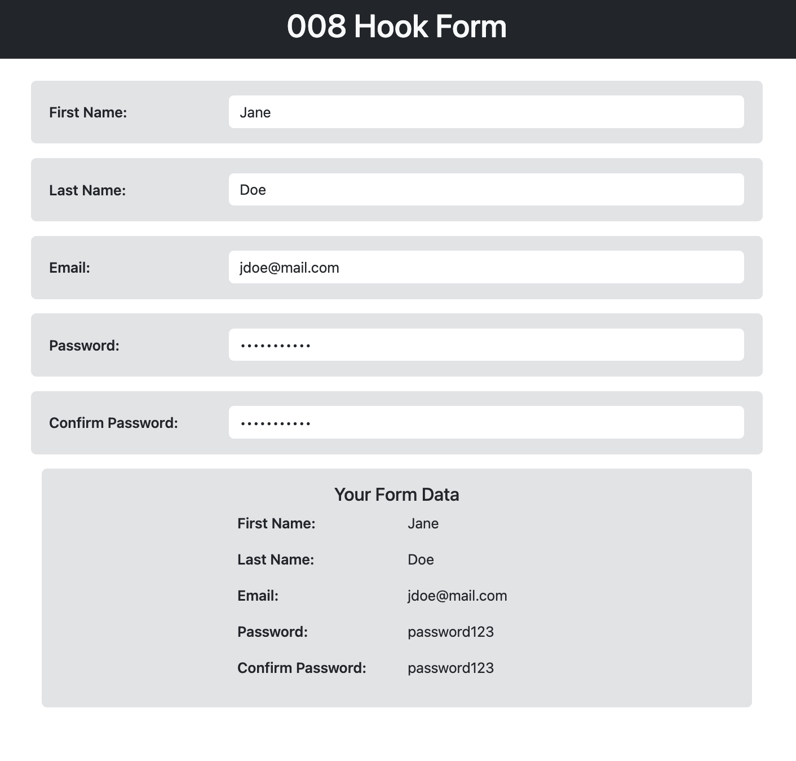

# Hook Form

## Table of Contents
1. [Introduction](#introduction)
2. [Installation](#installation)
4. [Form Component](#form-component)
    1. [State Management with `useState`](#state-management-with-usestate)
    2. [Input Change Handler](#input-change-handler)
    3. [Form Fields Setup](#form-fields-setup)
5. [Running the Application](#running-the-application)

### Introduction
This project showcases a simple React Hook Form for collecting user data. The form includes fields for **first name**, **last name**, **email**, **password**, and **confirm password**. The collected data is then displayed below the form.

### Installation
To set up the project locally, follow these steps:
```bash
git clone [repository_url]
cd [project_folder]
npm install
```


## Form Component

<div align="center">

</div>

### State Management with `useState`
```jsx
const [user, setUser] = useState({
  firstName: '',
  lastName: '',
  email: '',
  password: '',
  confirmPassword: ''
});
```
In this code snippet, the `useState` hook is utilized to create a state variable named `user` to manage the form data. It is initialized with an object containing properties for each form field (`firstName`, `lastName`, `email`, `password`, and `confirmPassword`), all initially set to empty strings.

The `setUser` function is used to update the state whenever there's a change in any of the form fields.

### Input Change Handler

```jsx
const changeHandler = (e) => {
  setUser({ ...user, [e.target.name]: e.target.value });
};
```
The `changeHandler` function is triggered by the `onChange` event of each input field. It takes the event object `e`, extracts the `name` and `value` properties from the input element, and uses them to update the corresponding property in the `user` state.

The spread operator (`...user`) is used to create a shallow copy of the current state, ensuring that the existing properties are retained while only updating the relevant one.

### Form Fields Setup

```jsx
<input
  type="text"
  name="firstName"
  onChange={changeHandler}
  className="form-control"
/>
```
Each input field in the form is set up with the following attributes:

- `type`: Specifies the type of input (text, password, etc.).
- `name`: Identifies the input field, linking it to the corresponding property in the `user` state.
- `onChange`: Associates the `changeHandler` function with the input's change event, ensuring that the form data is updated when the user types.

The `className` is used for Bootstrap styling and can be customized based on your project's design.

This structured approach ensures that the form data is efficiently managed in the component state, and changes in the input fields are appropriately reflected in the state.


## Running the Application
To run the application locally, use the following command:
```bash
npm start
```
Visit [http://localhost:5173](http://localhost:5173) (or whichever host route the terminal directs to) in your browser to test the form.

---
<p align="right">Completed: ２０２３年１１月２８日（火）</p>