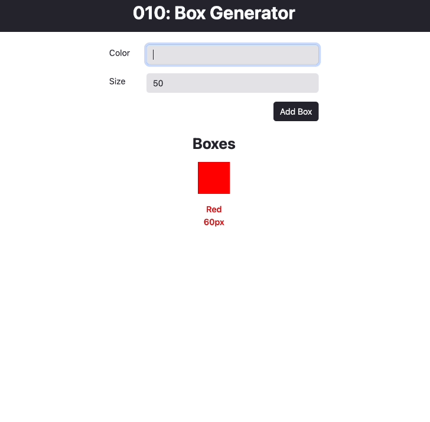

# Box Generator

### Project Overview

The Box Generator is a simple React application that allows users to dynamically generate colored boxes with specified sizes. It serves as an example project to demonstrate key concepts such as lifting state in React, handling user input through onChange handlers, and implementing input validations.

### Table of Contents

- [Features](#features)
- [Concepts Demonstrated](#concepts-demonstrated)
- [Components and Logic](#components-and-logic)
  - [App Component](#app-component)
  - [BoxGeneratorForm Component](#boxgeneratorform-component)
  - [DisplayGeneratedBoxes Component](#displaygeneratedboxes-component)

## Features

- Generate colored boxes with specified sizes.
- Input validation to ensure valid color format.
- Demonstration of lifting state in React.

## Concepts Demonstrated

### Lifting State

In React, state is typically managed within a component. However, in some cases, it's beneficial to share state between components. This is where lifting state comes into play. In this project, we use the `listOfBoxes` state to store the generated boxes, and this state is lifted to both the `BoxGeneratorForm` and `DisplayGeneratedBoxes` components. This allows them to share and update the same state.

### onChange Handlers

The `onChange` handlers are functions that are triggered when the value of an input field changes. In the `BoxGeneratorForm` component, we have two `onChange` handlers: `handleColor` and `handleSize`. These functions update the state (`boxColor` and `boxSize`) as the user inputs values. The `handleColor` function also includes input validation to ensure a valid color format.

### Input Validations

To enhance user experience and prevent errors, the project includes input validations. The `handleColor` function uses a regular expression to check if the entered color is a valid hex code or HTML color name. If the input is invalid, an error message is displayed, and the "Add Box" button is disabled until a valid color is entered.

## Components and Logic

### App.jsx

The `App` component initializes the `boxColorArray` state using the `useState` hook. This state is then passed down to the child components (`BoxGeneratorForm` and `DisplayGeneratedBoxes`) as props, facilitating the sharing of state.

### BoxGeneratorForm.jsx

The `BoxGeneratorForm` component is responsible for rendering the form where users input the color and size of the boxes. It captures user input using `onChange` handlers (`handleColor` and `handleSize`) and validates the color format. Upon submission, it updates the shared state (`listOfBoxes`) with the new box data.

### DisplayGeneratedBoxes.jsx

The `DisplayGeneratedBoxes` component receives the `listOfBoxes` state as a prop and renders the generated boxes along with their color and size details. It showcases how the shared state is used across components, allowing real-time updates as new boxes are added.

---

Completed: ２０２３年１２月０８日（金）

