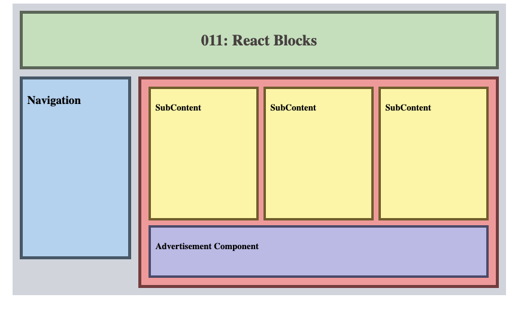

# React Blocks

This repository serves as a reference guide for styling a React application named React Blocks using CSS Modules. Below, you'll find key information on setting up the project, utilizing CSS Modules in React, and understanding the application's structure.

### Table of Contents

- [Getting Started](#getting-started)
- [CSS Modules in React](#css-modules-in-react)
    - [Why CSS Modules?](#why-css-modules)
- [Applying CSS Modules in React Blocks](#applying-css-modules-in-react-blocks)
    - [Example: Styling the Header Component](#example-styling-the-header-component)
    - [Child Components Styling](#child-components-styling)
    - [Importance of Passing Down { children }](#importance-of-passing-down-children)


## Getting Started

1. Clone the repository.
2. Install dependencies: `npm install styled-components`.
3. Start the development server: `npm run dev`.

## CSS Modules in React

<div align="center">

</div>

CSS Modules are a way to locally scope styles in React applications, preventing global style conflicts and providing better maintainability. In React Blocks, we use the popular `styled-components` library to implement CSS Modules.

### Why CSS Modules?

1. **Scoped Styles**: CSS Modules allow us to encapsulate styles within each React component. This scoping prevents unintended style leaks and conflicts in large projects.

2. **Maintainability**: Styles are co-located with the components they style, making it easier to understand and maintain the styling logic for each part of the application.

3. **No Global Namespace Pollution**: By using CSS Modules, there's no risk of polluting the global namespace with style names, reducing the likelihood of naming collisions.

## Applying CSS Modules in React Blocks

Instead of explaining each file individually, let's understand how CSS Modules are applied throughout the project.

### Example: Styling the Header Component

In `Header.styled.jsx`:

```css
import styled from "styled-components";

export const StyledHeader = styled.header`
    background-color: #CCE3C5;
    /* ... other styles ... */
    
    h1 {
        color: #504848;
        text-align: center;
    }
`
```

Here, the styles defined in `StyledHeader` are scoped to the `Header` component, ensuring that these styles won't affect other parts of the application.

### Child Components Styling

The `Main` component in `Main.jsx` utilizes CSS Modules and the `children` prop to display child components:

```jsx
import Main from './components/Main';

// Inside Main.jsx
import { StyledMain } from './styles/Main.styled';

const Main = ({ children }) => {
    return (
        <StyledMain>
            { children }
        </StyledMain>
    );
}
```

### Importance of Passing Down { children }

In `App.jsx`, the `Main` component receives child components as `{ children }`. This is essential for the SubContent child components to appear within the Main Parent Component.

```jsx
function App() {
  return (
    <Container>
      <Header />
      <Navigation />
      <Main>
        <SubContent />
        <SubContent />
        <SubContent />
        <Advertisement />
      </Main>
    </Container>
  );
}
```

By passing down `{ children }`, we enable dynamic content within the `Main` component, allowing for the inclusion of various child components.


---
<p align="right">Completed: ２０２３年１２月０８日（金）</p>