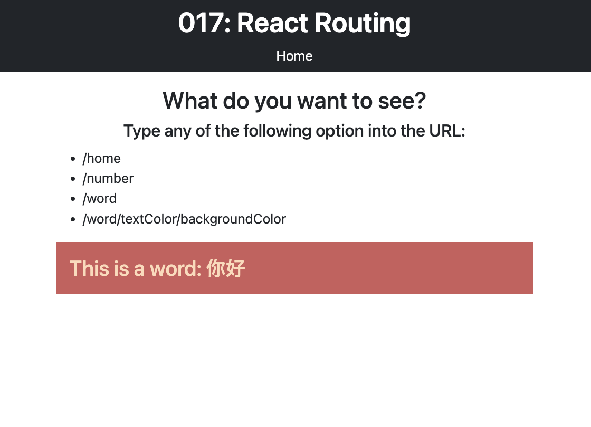

# React Routing Practice

This project demonstrates basic routing in a React application using the `react-router-dom` library. The main files involved are `main.jsx`, `App.jsx`, `Home.jsx`, and `ParamsComponent.jsx`.

## Table of Contents

- [Setting Up `react-router-dom`](#setting-up-react-router-dom)
- [Files Overview](#files-overview)
  - [`main.jsx`](#mainjsx)
  - [`App.jsx`](#appjsx)
  - [`Home.jsx`](#homejsx)
  - [`ParamsComponent.jsx`](#paramscomponentjsx)

## Setting Up `react-router-dom`:

Before implementing routing in a React application, you need to install the `react-router-dom` library. Open your terminal and run the following command:

```bash
npm install react-router-dom
```

This installs the necessary dependencies for routing in your project. Once installed, you can import the required components from `react-router-dom` and start building your routes.


## Files Overview:

<div align="center">

</div>

### `main.jsx`

This file serves as the entry point for the application. It uses the `ReactDOM.createRoot` method to render the `App` component within a `BrowserRouter`. The `BrowserRouter` provides the navigation context for the application.

```jsx
import React from 'react'
import ReactDOM from 'react-dom/client'
import App from './App.jsx'
import { BrowserRouter } from 'react-router-dom'

ReactDOM.createRoot(document.getElementById('root')).render(
  <React.StrictMode>
    <BrowserRouter>
      <App />
    </BrowserRouter>
  </React.StrictMode>,
)
```

### `App.jsx`

The `App` component is the main component that contains the navigation structure. It uses the `Link` component for navigation links and the `Routes` and `Route` components to define the routes and their corresponding components.

```jsx
import { Routes, Route, Link } from "react-router-dom"
import Home from "./components/Home"
import ParamsComponent from "./components/ParamsComponent"

function App() {
  // ... (styles and header)

  return (
    <>
      {/* ... (header section) */}
      
      <div className="container-fluid">
        {/* ... (intro section) */}
        
        <Routes>
          <Route path="/home" element={ <Home /> } />
          <Route path="/:string" element={ <ParamsComponent /> } />
          <Route path="/:string/:textColor/:bgColor" element={ <ParamsComponent /> } />
        </Routes>
        
      </div>
    </>
  )
}

export default App
```

### `Home.jsx`

The `Home` component is a simple component that displays a welcome message in different languages.

```jsx
import React from 'react';

const Home = () => {
    return (
        <div className='text-center'>
            {/* ... (welcome messages) */}
        </div>
    );
}

export default Home;
```

### `ParamsComponent.jsx`

The `ParamsComponent` component extracts parameters from the route using `useParams` and renders content based on whether the parameter is a word or a number.

```jsx
import React from 'react';
import { useParams } from 'react-router-dom';

const ParamsComponent = () => {
    const { string, textColor, bgColor } = useParams();
    
    return (
        <div className='col-10 col-md-5 mx-auto'>
            {/* ... (conditional rendering based on parameters) */}
        </div>
    );
}

export default ParamsComponent;
```


---
<p align="right">Completed: ２０２３年１２月１１日（月）</p>