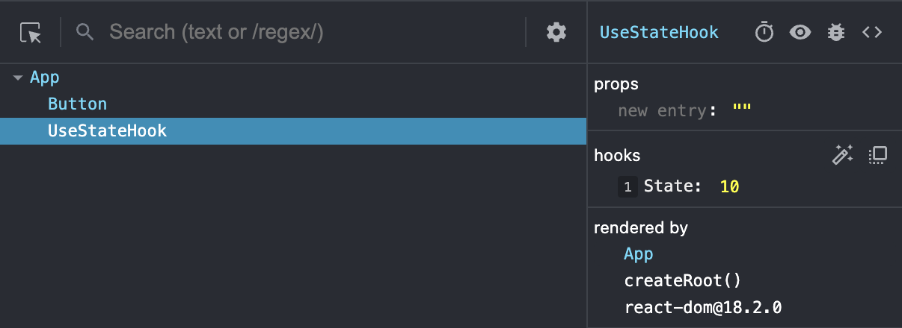

# D4: Synthetic Events and **`useState`**

<div style="display: flex; justify-content: space-between;">
    <p>Week 2 Session 1</p>
    <p>２０２３年１１月１５日（水）</p>
</div>

This React project serves as a demonstration of key concepts such as Synthetic Events and the useState hook. Below are explanations of how these concepts are applied in different components.

## Synthetic Events

### Button Component (Button.jsx)

The `Button` component showcases the use of Synthetic Events in React to handle user interactions such as clicks. By defining a function (`alertBtn`) and attaching it to the `onClick` event of a button, we can efficiently manage events without cluttering the HTML. In this case, clicking the button triggers an alert.

```jsx
// Button.jsx
const Button = () => {
    const alertBtn = () => alert("You clicked me!");
    
    return (
        <div className='mb-3'>
            <p>We can create <strong>Synthetic Events</strong> via JS/JSX to declutter the HTML:</p>
            <button onClick={alertBtn} className="btn btn-dark">
                Click Me!
            </button>
        </div>
    );
}
```

## useState

### UseStateHook Component (UseStateHook.jsx)

The `UseStateHook` component demonstrates the use of the useState hook in managing state within functional components. It maintains a count state, which is initially set to 10. Clicking the "Increment Count" button triggers a state update, incrementing the count.

```jsx
// UseStateHook.jsx
const UseStateHook = () => {
    const [count, setCount] = useState(10);

    const incrementCount = () => setCount(count + 1);

    return (
        <div className='mb-3'>
            <h4>Using the useState hook:</h4>
            <p>The current count is: <strong>{count}</strong></p>
            <button onClick={incrementCount} className="btn btn-dark">Increment Count</button>
        </div>
    );
}
```

#### Notes: State works similarly to **`session`** in python; **`useState`** can be used to store values in the hook:
<div align="center">

</div>

## Props

### Show Component (Show.jsx)

The `Show` component utilizes props to receive and display information about different TV shows. It also incorporates the useState hook to manage the count of likes. Clicking the "Like Show" button increments the like count.

```jsx
// Show.jsx
const Show = ({ showTitle, releaseYear, likes }) => {
    const [likeCount, setLikeCount] = useState(likes);

    return (
        <div className='mb-3'>
            <h3>Title: {showTitle}</h3>
            <p>Release Year: {releaseYear}</p>
            <p>Likes: <strong>{likeCount}</strong></p>
            <button onClick={() => setLikeCount(likeCount + 1)} className="btn btn-primary mt-2">
                <strong>Like Show</strong>
            </button>
        </div>
    );
}
```

### Summary 

This React project demonstrates key concepts:

- **Synthetic Events:** Illustrated in the `Button` component, showcasing clean event handling in React.

- **useState Hook:** Featured in the `UseStateHook` component, emphasizing state management in functional components.

- **Props Usage:** Utilized in the `Show` component to dynamically render TV show information, highlighting component reusability.
