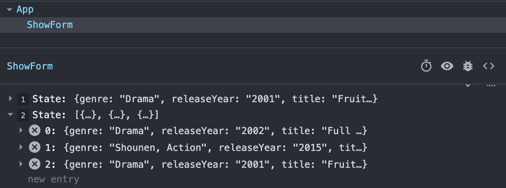

# D6: Functional Programming

Concepts: **Ternary Operators, Higher Order and Callback Functions (Map & Filter)**

<div style="display: flex; justify-content: space-between;">
    <p>Week 2 Session 3</p>
    <p>２０２３年１２月０１日（金）</p>
</div>

### Table of Contents

- [Introduction](#introduction)
- [Component State](#component-state)
- [Form Input Handling](#form-input-handling)
- [Form Submission](#form-submission)
- [Ternary Operators for Validation and Feedback](#ternary-operators-for-validation-and-feedback)
- [Form Contents Display](#form-contents-display)
- [Conclusion](#conclusion)


# React Form with Ternary Operators - README

## Introduction

This React component, `ShowForm`, is designed to capture and display information about shows through a form. It incorporates ternary operators to enhance the user experience by providing immediate feedback and validation.

### Component State

The component uses the `useState` hook to manage the state of the form. It maintains three pieces of state:

1. `show`: An object that holds information about the current show being entered (title, release year, and genre).
2. `allShows`: An array that collects all the shows submitted through the form.

<div align="center">

</div>

### Form Input Handling

The `changeHandler` function is triggered when any input field in the form changes. It updates the `show` state with the new values entered by the user.

### Form Submission

The `submitHandler` function is called when the user submits the form. It prevents the default form submission behavior, adds the current `show` to the `allShows` array, and updates the state accordingly.

### Ternary Operators for Validation and Feedback

Ternary operators are employed to display immediate feedback to users based on certain conditions:

#### 1. Title Validation
```javascript
{
    show.title.length < 2 ?
    <p className="text-center text-danger fw-medium">The title must be at least 2 characters</p>
    : null
}
```
If the length of the title is less than 2 characters, a red error message is displayed. Otherwise, it remains null.

#### 2. Release Year Validation
```javascript
{
    show.releaseYear < 1920 ?
    <p className="text-center text-danger fw-medium">The release year must be after 1919</p>
    : null
}
```
If the release year is before 1920, a red error message is displayed. Otherwise, it remains null.

#### 3. Genre Validation
```javascript
{
    show.genre.length < 2 ?
    <p className="text-center text-danger fw-medium">The genre must be at least 5 characters</p>
    : null
}
```
If the length of the genre is less than 5 characters, a red error message is displayed. Otherwise, it remains null.

### Form Contents Display

Below the form, there is a section displaying the contents of the form. This section is updated in real-time as the user enters information, providing a preview of the entered data.

### Conclusion

By incorporating ternary operators for validation and feedback, this React form enhances the user experience, guiding them through the input process and ensuring the submission of valid data. The component efficiently manages state, captures user input, and displays dynamic content based on conditional logic.
