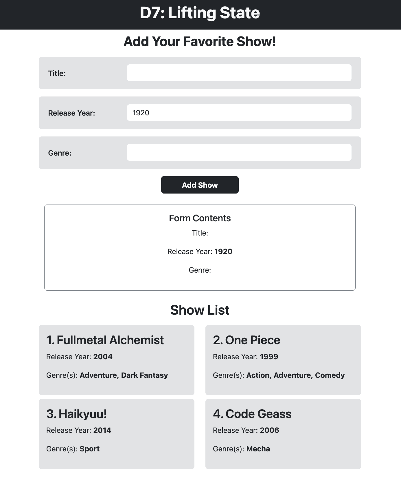

# D7: Lifting State in React

Concepts: **Lifting State, Iterating with Map, and Intro to APIs with `useEffect` and Axios**

<div style="display: flex; justify-content: space-between;">
    <p>Week 3 Session 1</p>
    <p>２０２３年１２月０６日（水）</p>
</div>

In this React application, lifting state is utilized to manage and share state between components. The primary objective is to enable data flow from a parent component to its child components. Let's explore how this concept is implemented in the code, specifically in the relationship between `App.jsx` (the parent component) and its child components, `ShowForm.jsx` and `DisplayShows.jsx`.

### Table of Contents

1. [App.jsx](#appjsx)
2. [ShowForm.jsx](#showformjsx)
3. [DisplayShows.jsx](#displayshowsjsx)

## App.jsx

<div align="center">

</div>

Within `App.jsx`, the `allShows` state is lifted up to the parent component using the `useState` hook. This state represents the list of shows and is initialized as an empty array. The state and its setter function (`setAllShows`) are then passed down as props to the child components.

```javascript
const [allShows, setAllShows] = useState([]);
```

## ShowForm.jsx

### State Management
In `ShowForm.jsx`, a local state (`show`) captures the details of a show. This local state is initialized using the `useState` hook. The state is updated as the user interacts with the form inputs through the `changeHandler` function.

```javascript
const [show, setShow] = useState({
  title: '',
  releaseYear: 1920,
  genre: '',
});
```

### Lifting State
To share the show data with the parent (`App.jsx`), the `ShowForm` component receives `showList` and `setShowList` as props. The `submitHandler` function is responsible for updating the parent's state (`allShows`) with the new show data.

```javascript
const submitHandler = (e) => {
  // ... (form submission logic)
  setShowList([...showList, show]);
  setShow({ title: '', releaseYear: 1920, genre: '' });
};
```

### Managing State with `submitHandler`

In the `ShowForm.jsx` component, the `submitHandler` function plays a key role in managing the state when a user submits the form. Let's break down how this function handles the state:

1. Prevent Default Behavior
    
    ```javascript
    e.preventDefault(); // prevents browser from auto-refreshing
    ```
    This line prevents the default form submission behavior, which would cause a page refresh. By calling `preventDefault()`, the form data is submitted without triggering a page reload.

2. Logging the New Show Object
    
    ```javascript
    console.log(`This is the new show: ${JSON.stringify(show)}`);
    ```
    This log statement provides visibility into the newly created show object. The `JSON.stringify(show)` ensures that the object is displayed in a readable format. This is especially helpful for debugging and understanding the structure of the data being submitted.

    3. Updating the Show List State
    
    ```javascript
    setShowList([...showList, show]);
    ```
    This line uses the `setShowList` function, which is passed down from the parent (`App.jsx`). It updates the `allShows` state by spreading the existing show list (`...showList`) and adding the new show (`show`) to the end. This immutability ensures that the state is updated correctly.

4. Resetting the Form State
    
    ```javascript
    setShow({ title: '', releaseYear: 1920, genre: '' });
    ```
    After submitting the form, it's essential to reset the form inputs. This line uses `setShow` to update the local state (`show`) back to its initial state, clearing the form fields. The default values for `title`, `releaseYear`, and `genre` are set accordingly.

5. Value Attributes for Two-Way Data Binding
    
    ```html
    <input
    type="text"
    name="title"
    onChange={changeHandler}
    value={show.title}
    className="form-control"
    />
    ```
    
    To achieve two-way data binding and ensure that the form reflects the current state, the value attribute is set to the corresponding property in the show state. For example, value={show.title} binds the input value to the title property of the show state.
    
    #### Why Declare `value={ object.keyName }`?
    Declaring `value={ object.keyName }` ensures that the input field always reflects the current state of the show object. Without this binding, the input field would not update when the state changes, leading to a mismatch between the displayed value and the actual state. By explicitly connecting the input value to the state property, you achieve a seamless synchronization between the form and the underlying data, providing a clear and accurate user interface.


### Summary

The **`submitHandler`** function effectively manages the state by preventing the default form behavior, logging the new show object for visibility, updating the show list state (`allShows`), resetting the form state to ensure a seamless user experience, and utilizing **two-way data binding** to keep the form in sync with the state. This comprehensive approach ensures consistent and reliable state management in the ShowForm component.


## DisplayShows.jsx

### Displaying State
In `DisplayShows.jsx`, the `showList` received as a prop is mapped to create individual show components. The `map` function iterates through the list of shows, and for each show, it renders a component displaying its details.

```javascript
showList.map((show, index) => (
  // ... (rendering individual show components)
))
```


## Conclusion
Lifting state is a crucial concept in React to facilitate communication between components. By lifting state up to a common ancestor, components can share and update data effectively. In the application, the `App.jsx` component serves as the central hub for managing the state, while `ShowForm.jsx` and `DisplayShows.jsx` act as child components benefiting from this shared state.