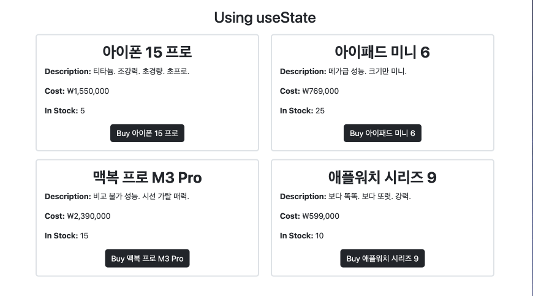
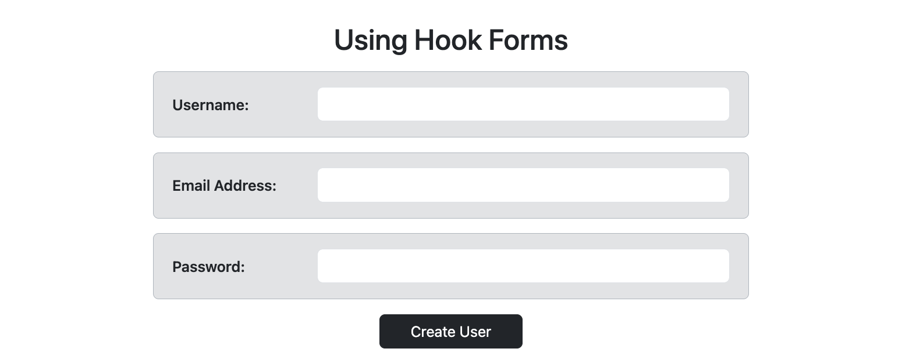

# Learn React Project

### Table of Contents
1. [App Component](#app-component)
    1. [`Product` Component](#3-product-component)
    2. [`UserForm` Component](#2-userform-component)
        1. [Form State Management](#form-state-management)
        2. [Form Submission](#form-submission)
        3. [Form Input Fields](#form-input-fields)
        4. [Submit Button](#submit-button)
    3. [Conditionally Rendered UserForm Component](#conditionally-rendered-userform-component)
        1. [Username Validation](#username-validation)
        2. [Form Submission - Updated Button](#form-submission---updated-button)
    3. [`ChildrenTestComponent` Component](#4-childrentestcomponent-component)
        1. [Usage in App.jsx](#usage-in-appjsx)
        2. [ChildrenTestComponent Implementation](#childrentestcomponent-implementation)
        3. [Understanding Children Props](#understanding-children-props)


## App Component

The `App` component is the main component that orchestrates the structure of the React Vite project. It includes a header, product displays using the `Product` component, and a form using the `UserForm` component.

Example usage:

```jsx
import Product from './components/Product';
import UserForm from './components/UserForm';

function App() {
    // ... (component content)
}

export default App;
```

## 1. `Product` Component

<div align="center">

</div>

The `Product` component is responsible for displaying information about a product. It takes props such as `title`, `desc`, `cost`, and `initialStock` to render a product card. The component uses state with `useState` to manage the stock availability.

Example usage:

```jsx
import React, { useState } from 'react';

const Product = ({ title, desc, cost, initialStock }) => {
    // ... (component content)
};

export default Product;
```

## 2. `UserForm` Component

<div align="center">

</div>

The `UserForm` component is a form designed to capture user information. It uses `useState` to manage form inputs for `username`, `email`, and `password`. The form includes an `onSubmit` event handler to create a new user object and log a welcome message.

Example usage:

```jsx
import React, { useState } from 'react';

const UserForm = (props) => {
    // ... (component content)
};

export default UserForm;
```

### Form State Management

The form state management section explains how the `useState` hook is used within the `UserForm` component to dynamically manage the state of the form inputs (`username`, `email`, `password`).

### Form Submission

This section describes the `onSubmit` event handler in the `UserForm` component. It prevents the default form submission behavior, creates a new user object with entered information, and logs a welcome message to the console.

### Form Input Fields

The form input fields section explains how each input field within the `UserForm` component is enclosed within a styled container for visual clarity. The `onChange` event is utilized to update the corresponding state variable as the user types.

### Submit Button

This section describes the submit button in the `UserForm` component. The button triggers the `onSubmit` event and has a dark-themed style for consistency with the overall design.


## Conditionally Rendered UserForm Component

The `UserForm` component has been enhanced to include live error validations using ternary operators. These changes provide immediate feedback to users as they fill out the form.

### Username Validation

The username input field now undergoes real-time validation. The `handleUsername` function utilizes ternary operators to dynamically update the `usernameError` state based on the length of the entered username.

```jsx
// * Handle Validations with Ternary Operators
const handleUsername = (e) => {
    setUsername(e.target.value);
    if (e.target.value.length < 1) {
        setUsernameError("Username is required!");
    } else if (e.target.value.length < 3) {
        setUsernameError("Username must be at least 3 characters!");
    } else {
        setUsernameError(""); // Empty String is equivalent to "falsy" value
    }
}
```

The error message is then conditionally rendered below the username input field, providing feedback to the user in case of validation errors.

```jsx
<div className="mb-3 row bg-secondary-subtle py-3 px-2 rounded border border-dark-subtle">
    <label className="col-md-3 col-form-label fw-semibold">Username: </label>
    <div className="col-md-9">
        <input type="text" onChange={handleUsername}
            value={username} className="form-control" />
        {usernameError ?
            <p className="mx-auto text-center fw-medium text-danger mb-0 mt-2">{usernameError}</p> :
            ''
        }
    </div>
</div>
```

### Form Submission - Updated Button

The submit button now dynamically disables when there is a validation error in the username. This is achieved using a ternary operator on the `usernameError` state.

```jsx
<div className="row col-3 mx-auto">
    {usernameError ?
        <input type="submit" value="Create User" className='btn btn-dark' disabled /> :
        <input type="submit" value="Create User" className='btn btn-dark' />
    }
</div>
```

If there is a validation error in the username, the button is disabled, preventing the user from submitting the form until the error is resolved.

These enhancements create a more user-friendly form with immediate feedback, guiding users through the submission process.


## 4. `ChildrenTestComponent` Component

The `ChildrenTestComponent` is a React component that demonstrates the use of children props. Children props allow you to pass down components or elements as children to a parent component, enabling a flexible and dynamic composition of components.

### Usage in App.jsx

In the `App.jsx` file, the `ChildrenTestComponent` is utilized to showcase the passing of children components via props. The component is invoked with a `header` prop and children components nested within it:

```jsx
<ChildrenTestComponent header={ "This is a Header Prop!" } >
  <h3>Here are the children components passed down via props:</h3>
  <ul>
    <li>First Child</li>
    <li>Second Child</li>
    <li>Final Child</li>
  </ul>
</ChildrenTestComponent>
```

### ChildrenTestComponent Implementation

The `ChildrenTestComponent` is a functional component that receives two props: `header` and `children`. The `header` prop is a string used as a title, and the `children` prop is a special prop that represents any components or elements nested within the component tags.

```jsx
import React from 'react';

const ChildrenTestComponent = ({ header, children }) => {
    return (
        <div>
            <p>The text below is passed as a children prop:</p>
            <h1 className='text-center'>{ header }</h1>
            { children }
        </div>
    );
}

export default ChildrenTestComponent;
```

### Understanding Children Props

The `children` prop allows for dynamic content injection into a component. In this example, it renders the provided header and any children components passed down, creating a reusable and customizable component structure.

This approach is beneficial when you want to create components that can have variable content while maintaining a consistent structure.


---
<p align="right">Updated: ２０２３年１２月０１日（木）</p>