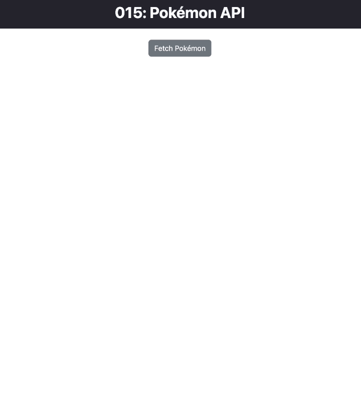

# Pokémon API

This React project utilizes the Pokémon API to fetch and display information about Pokémon. The main components involved are `App.jsx` and `RenderPokemon.jsx`.

<div align="center">

</div>

## App.jsx

```jsx
import RenderPokemon from "./components/RenderPokemon"

function App() {
  return (
    <>
      <header className="bg-dark text-light py-2 mb-2">
        <h1 className='fw-bold text-center'>015: Pokémon API</h1>
      </header>
      
      <div className="container-fluid">
        <div className="col-8 mx-auto">
          <RenderPokemon />
        </div>
      </div>
    </>
  )
}

export default App
```

This file serves as the main entry point for the React application. It imports and renders the `RenderPokemon` component.

## RenderPokemon.jsx

```jsx
import React, { useEffect, useState } from 'react';

const RenderPokemon = () => {
    // State to hold the array of Pokémon objects and track button click
    const [ pokemon, setPokemon ] = useState([]);
    const [ buttonClicked, setButtonClicked ] = useState(false);
    
    // useEffect to fetch Pokémon data when the button is clicked
    useEffect(() => {
        if ( buttonClicked ) {
            fetch('https://pokeapi.co/api/v2/pokemon?limit=807')
                .then(response => response.json())
                .then(response => {
                    setPokemon(response.results);
                })
                .catch(error => console.log(error));
        }
    }, [ buttonClicked ]);

    // Function to handle button click
    const handleButtonClick = () => {
        setButtonClicked(true);
    }
    
    // JSX to render the button and Pokémon list
    return (
        <div className='my-4'>
            <div className="d-flex justify-content-center">
                <button onClick={ handleButtonClick } className="btn btn-secondary">
                    Fetch Pokémon
                </button>
            </div>
            
            {buttonClicked && (
                <ul>
                { pokemon.map(( pokemonObject, index ) => {
                    return ( <li key={ index }>{ pokemonObject.name }</li> )
                }) }
                </ul>
            )}
        </div>
    );
}

export default RenderPokemon;
```

This file contains the `RenderPokemon` component, which handles fetching and displaying Pokémon data based on a button click. The `useEffect` hook is used to manage the API call.

1. **State Initialization:**
   - `const [pokemon, setPokemon] = useState([]);`: Initializes state to hold an array of Pokémon objects. Initially set to an empty array.

   - `const [buttonClicked, setButtonClicked] = useState(false);`: Initializes state to track whether the button has been clicked. Initially set to `false`.

2. **`useEffect` Hook:**
   - `useEffect(() => {...}, [buttonClicked]);`: This hook runs the provided function whenever the component renders, but in this case, it also depends on the `buttonClicked` state.

3. **Function Inside `useEffect`:**
   - `if (buttonClicked) {...}`: Checks if the `buttonClicked` state is `true`. If true, it proceeds to fetch data from the Pokémon API.

   - `fetch('https://pokeapi.co/api/v2/pokemon?limit=807')`: Initiates a network request to the specified URL, which is the Pokémon API endpoint for retrieving a list of Pokémon.

   - `.then(response => response.json())`: Converts the response to JSON format.

   - `.then(response => { setPokemon(response.results); })`: Sets the `pokemon` state with the array of Pokémon objects retrieved from the API response.

   - `.catch(error => console.log(error));`: Handles any errors that might occur during the fetch operation.

4. **Button Click Handler:**
   - `const handleButtonClick = () => { setButtonClicked(true); }`: Defines a function to set `buttonClicked` to `true` when the button is clicked.

5. **Rendering JSX:**
   - The JSX renders a button with an `onClick` event that triggers the `handleButtonClick` function.

   - If `buttonClicked` is `true`, it renders an unordered list (`<ul>`) containing list items (`<li>`) for each Pokémon name in the `pokemon` array.


## Understanding RESTful APIs and useEffect

### RESTful APIs

REST (Representational State Transfer) is an architectural style for designing networked applications. RESTful APIs are designed around a set of principles, including stateless communication, resource identification through URIs, and standard HTTP methods (GET, POST, PUT, DELETE).

### `useEffect` in this Scenario

In summary, the `useEffect` is responsible for fetching Pokémon data when the button is clicked (`buttonClicked` state changes). It ensures that the API call is made when needed and not on every render. The fetched data is stored in the `pokemon` state, which then triggers a re-render to display the Pokémon names.

---
<p align="right">Completed: ２０２３年１２月１１日（月）</p>