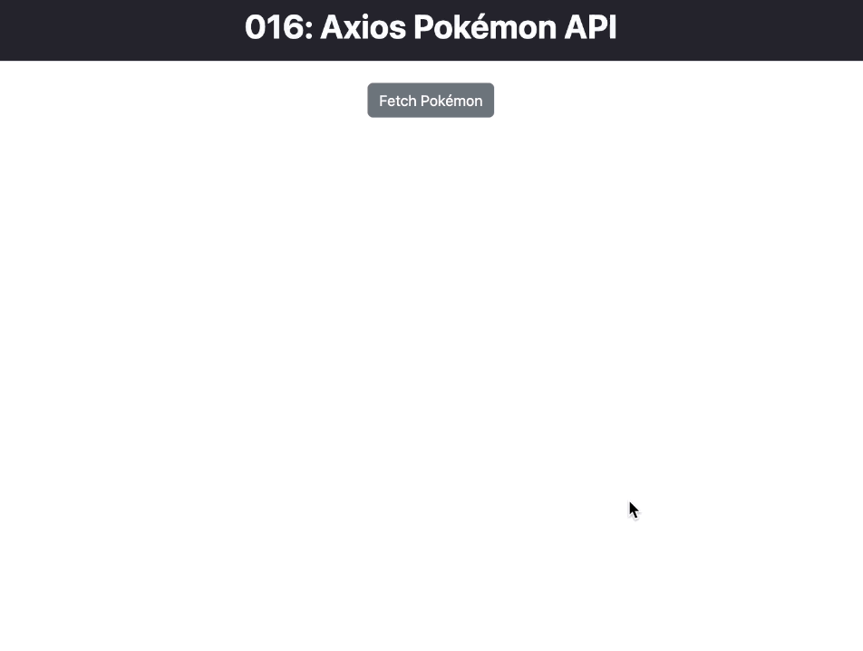
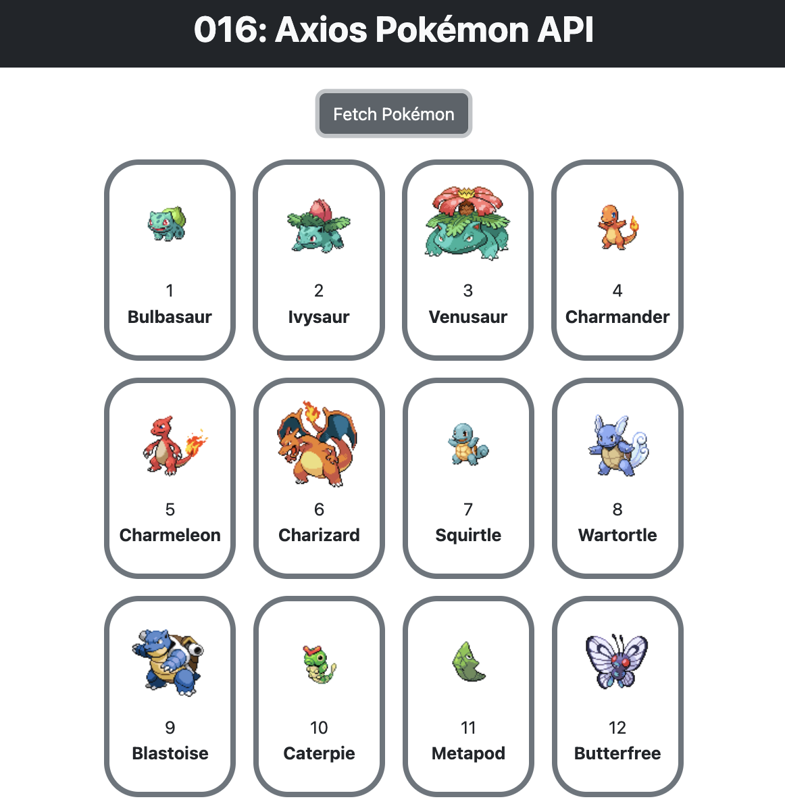

# Axios Pokémon API

This React project utilizes the Pokémon API to fetch and display information about Pokémon. The main component involved is `RenderPokemon.jsx`.

<div align="center">

</div>

## RenderPokemon.jsx

```jsx
import React, { useEffect, useState } from 'react';
import axios from 'axios'

const RenderPokemon = () => {
    // State to hold the array of Pokémon objects and track button click
    const [pokemonData, setPokemonData] = useState([]);
    const [buttonClicked, setButtonClicked] = useState(false);
    
    // useEffect to fetch Pokémon data when the button is clicked
    useEffect(() => {
        axios.get('https://pokeapi.co/api/v2/pokemon?limit=807')
            .then((response) => {
                const pokemonArray = response.data.results;
                setPokemonData(pokemonArray);
            })
            .catch(error => console.log(error));
    }, [buttonClicked]);
    
    const handleButtonClick = () => {
        setButtonClicked(true);
    }
    
    // JSX to render the button and Pokémon list
    return (
        <div className='my-4'>
            <div className="d-flex justify-content-center">
                <button onClick={handleButtonClick} className="btn btn-secondary">
                    Fetch Pokémon
                </button>
            </div>
            
            {buttonClicked && (
                <ul>
                    {pokemonData.map((pokemon, index) => {
                        return (<li key={index}>{pokemon.name}</li>)
                    })}
                </ul>
            )}
        </div>
    );
}

export default RenderPokemon;
```

This file contains the `RenderPokemon` component, which handles fetching and displaying Pokémon data based on a button click. The `useEffect` hook is used to manage the API call using Axios.

#### Updated: ２０２３年１２月１１日（月）
In this updated version, the Pokémon data is now managed more efficiently. The sprites are displayed, and the elements are organized using flex properties for a cleaner presentation.

<div align="center">

</div>


### Understanding Axios and useEffect

#### Axios

[Axios](https://axios-http.com/) is a popular JavaScript library for making HTTP requests. In this project, Axios is used to perform the API request to the Pokémon API.

#### useEffect in this Scenario

In the `RenderPokemon.jsx` component, the `useEffect` hook is utilized to fetch Pokémon data from the Pokémon API when the button is clicked (`buttonClicked` state changes). This ensures that the API call happens only when necessary, preventing unnecessary network requests.

---
<p align="right">Completed: ２０２３年１２月１１日（月）</p>
