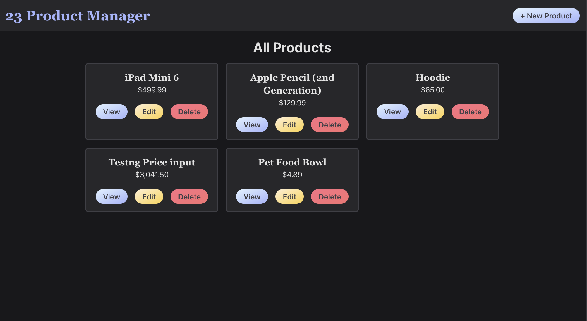
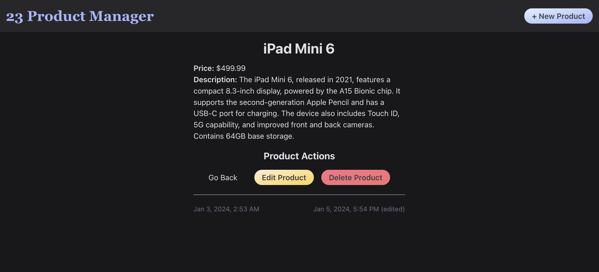
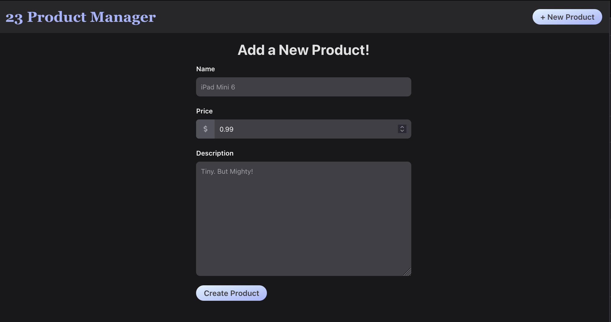
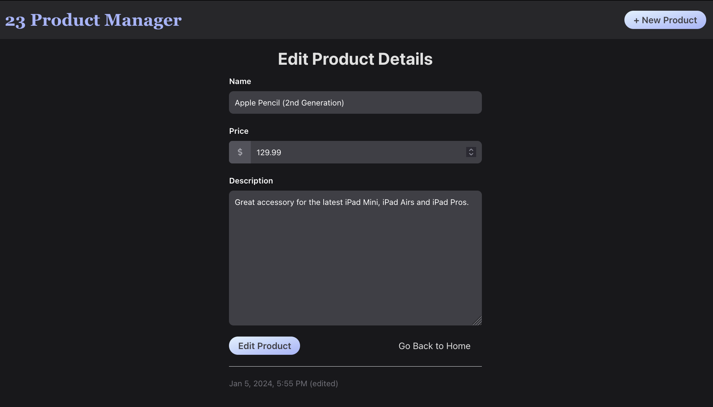

# Product Manager

### Table of Contents
- [Project Initialization](#project-initialization)
- [Tailwind CSS Installation and Usage in a Vite React Project](#tailwind-css-installation-and-usage-in-a-vite-react-project)
- [Product Manager - Components](#product-manager---components)
    - [`App.jsx`](#appjsx)
    - [`DisplayProducts.jsx`](#displayproductsjsx)
    - [`DisplayOne.jsx`](#displayonejsx)
    - [`CreateProductForm.jsx`](#createproductformjsx)
    - [`EditProductForm.jsx`](#editproductformjsx)
    - [Logic in `deleteHandler`](#logic-in-deletehandler)


## Project Initialization
For the project initialization, refer to the [D13-Server_Setup_w_Mongoose README](https://github.com/coderbri/MERN-Apr2023/blob/c09996835266cb9b75a5ff14c097fe49472fdf13/Wk4-Backend_Development/Lecture-Code/D13-Server_Setup_w_Mongoose/README.md) and for CORS implementation, go to this [project's README.md](https://github.com/coderbri/MERN-Apr2023/blob/f6efeda0fac558bd4b411f3d18c5a3ced068b783/Wk5-FullStack_MERN/Lecture-Code/D16-Full_CRUD_ShowApp/README.md).

## Tailwind CSS Installation and Usage in a Vite React Project
To incorporate Tailwind CSS into a Vite React project, access the official Tailwind CSS documentation guide for Vite by visiting [Tailwind CSS - Vite](https://tailwindcss.com/docs/guides/vite).


## Product Manager - Components

### `App.jsx`
This component serves as the main structure of the application, managing the overall layout, navigation, and routing. It organizes the different components responsible for displaying all products, creating a new product, and displaying details of a single product. Here's what it includes:

1. **State Management**: The component uses the `useState` hook to manage state. `products` is the state variable representing an array of Products, and `setProducts` is the function to update this state.
    ```js
    import { useState } from 'react';
    
    // the state of products is an array of objects
    const [ products, setProducts ] = useState([]);
    ```

2. **Header Section**: Displays a styled header (`HeaderStyled`) containing the application title as well as provides navigation links using Link from react-router-dom to navigate to the home page and the form for creating a new product.
    ```js
    import { BrowserRouter, Routes, Route, Link } from 'react-router-dom'
    {/* App function removed for brevity... */}
    <BrowserRouter>
        <HeaderStyled>
          <h1 className='text-3xl font-bold font-serif text-indigo-400 dark:text-indigo-300'>
            <a href="/">23 Product Manager</a>
          </h1>
          <nav className='flex justify-center items-center gap-4 mt-4 sm:mt-0'>
            <Link to={"/product/create-new"}>
              <Button>+ New Product</Button>
            </Link>
          </nav>
        </HeaderStyled>
        
        {/* Routes... */}
    </BrowserRouter>
    ```

3. **Routing within `App.jsx`**: Routing is facilitated by `react-router-dom`, allowing the application to render different components based on the URL path. The component is entirely wrapped with `BrowserRouter` to enable routing in the application. Furthermore, the Routes component contains different routes which specifies a path and the corresponding component to be rendered when the path is matched.
    ```js
    <Routes>
        <Route path={"/"} element={<DisplayProducts productList={products} setProductList={setProducts} />} />
        <Route path={"/product/details/:id"} element={<DisplayOne />} />
        <Route path={"/product/create-new"} element={<CreateProductForm />} />
        <Route path={"/product/edit-details/:id"} element={<EditProductForm />} />
    </Routes>
    ```

4. **Component Routes**: Contains the components that will display the relevant product data as well as pass the necessary the `product` state and the function to update it as props.

### `DisplayProducts.jsx`

<div align="center">

</div> 

#### Imports:
```jsx
import React, { useEffect } from 'react';
import { Link } from 'react-router-dom'
import axios from 'axios'

import Button from './styles/Button.styled';
import EditButton from './styles/EditButton.styled';
import DeleteButton from './styles/DeleteButton.styled';
import { formatPrice } from '../utils/formaPriceUtils';
```

1. **React and useEffect:** The component is built using React, and it utilizes the `useEffect` hook for handling side effects like data fetching.

2. **Link:** `Link` is imported from `react-router-dom` to create navigation links that allow the user to move between different views within the application.

3. **axios:** The `axios` library is imported for making HTTP requests. In this case, it's used to fetch data from the backend API.

4. **Styled Components:** Several styled components (`EditButton`, `DeleteButton`, `Button`) are imported. These define the styling for buttons in the UI.

5. **`formatPrice` Utility**: To enhance the user experience, the application uses a utility function `formatPrice` to format product prices consistently. The utility function is located in the `utils.js` file and is imported wherever necessary.
    ```js
    export const formatPrice = (price) => {
        return price.toLocaleString('en-US', { 
            minimumFractionDigits: 2, 
            maximumFractionDigits: 2
        });
    };
    ```


#### 1. Component Setup:
This component fetches data from the backend when it mounts using `useEffect` and `axios`. It renders a list of managed products, and each product has buttons for viewing details and performing other actions. The state is lifted up to the parent component (`App.jsx`), allowing for centralized state management. The child component receives the state and a function to update it as props.

```jsx
const DisplayProducts = ({ productList, setProductList }) => {/* ... */}
```
1. **Props:** The component takes two destructured props: `productList` and `setProductList`. These are used for managing the state of the managed products in the parent component (`App.jsx`). The list of products is passed as a prop, and the function to update this list is also passed.

#### 2. `useEffect` Hook:

```jsx
useEffect(() => {
    axios.get(`http://localhost:8000/api/products`)
        .then((res) => {
            console.log(res);
            setProductList(res.data);
        })
        .catch((err) => console.log(err));
}, []);
```
1. **Data Fetching:** The `useEffect` hook is used to perform side effects in the component. In this case, it's fetching data from the backend API.

2. **axios.get:** The `axios.get` method makes a GET request to the specified API endpoint (`http://localhost:8000/api/products`).
  
3. **Promise Handling:** The `then` block handles the promise when it resolves. It logs the entire response and the data part of the response to the console.

4. **Setting State:** The `setProductList` function is then used to update the state of managed products with the data received from the backend. The data structure can be assumed to be `{ products: [...] }`.

5. **Error Handling:** The `catch` block logs any errors that occur during the HTTP request.

#### 3. Component Rendering:
```jsx
return (
    <div>
        <h2 className='text-3xl font-bold text-center'>All Products</h2>
        <div className='mt-4 grid gap-4 sm:grid-cols-2 lg:grid-cols-3 xl:grid-cols-4'>
        { productList.map((product) => (
            <div key={product._id}
                className='p-4 rounded-md border-2 text-center
                    dark:border-zinc-700 dark:bg-zinc-800
                    light:border-slate-300 bg-slate-50'
            >
                <h3 className="text-xl font-semibold font-serif">{ product.productName }</h3>
                { product.productPrice && ( <p>${ formatPrice(product.productPrice) }</p> )}
                <div className="mt-5 flex justify-center gap-4">
                    <Link to={`/product/details/${product._id}`}>
                        <Button>View</Button>
                    </Link>
                    <Link to={`/product/edit-details/${product._id}`}>
                        <EditButton>Edit</EditButton>
                    </Link>
                    <DeleteButton onClick={() => deleteHandler(product._id)}>Delete</DeleteButton>
                </div>
            </div>
        ))}
        </div>
    </div>
);
```

1. **UI Structure:** The component returns JSX that renders a section containing the header and a grid for displaying products.

2. **Mapping Over Products:** The `productList.map()` function is used to iterate over each product in the list.

3. **Product Details:** For each product, it renders a `div` containing the name of the product, its price, and buttons for viewing, editing, and deleting.

4. **Navigation Link:** The `Link` component is used to create a navigation link to view the details of a specific product. It directs to the route `/product/details/:id` where `:id` is the unique identifier of the product.

5. **Styled Buttons:** Styled buttons (`Button`, `EditButton`, `DeleteButton`) are used for actions like viewing, editing, and deleting.


### `DisplayOne.jsx`

<div align="center">

</div> 

This component fetches details of a specific product based on the id parameter from the URL. It uses local state to store details of the product. The `useEffect` hook is used to trigger the API request when the component mounts, retrieving the product details to display in the JSX; buttons for editing and deleting the products are provided.

#### Imports

```js
import React, { useEffect, useState } from 'react';
import { useNavigate, useParams, Link } from 'react-router-dom';
import axios from 'axios'
import EditButton from './styles/EditButton.styled';
import DeleteButton from './styles/DeleteButton.styled';
import { formatDate } from "../utils/dateUtils"
import { formatPrice } from '../utils/formaPriceUtils';
```

1. **React, `useEffect`, useState**: The component is built using React and utilizes the `useEffect` and `useState` hooks for managing side effects and local state, respectively.

2. **`axios`**: The `axios` library is imported for making HTTP requests in this case, it's use to fetch details of a single product from the backend API.

3. **`useParams`**: The `useParams` hook from `react-router-dom` is used to access parameters from the URL. In this case, it retrieves the `id` parameter from the route.

4. **`EditButton` and `DeleteButton` Components**: Components for styling buttons (`EditButton` and `DeleteButton`) are imported.

5. **`formatDate` Utility**: To ensure a consistent and user-friendly display of dates across the application, a utility function called `formatDate` is utilized. This utility, located in the `dateUtils.js` file, is imported wherever date formatting is needed.

#### Component Setup:

```js
const DisplayOne = () => {
    const { id } = useParams();
    const navigate = useNavigate();
    
    const [ product, setProduct ] = useState({});
    useEffect(() => {
        axios.get(`http://localhost:8000/api/product/${id}`)
            .then((res) => {
                console.log(res);
                setProduct(res.data);
            })
            .catch((err) => console.log(err));
    }, []);
    
    // ...rest of the code is ommitted for brevity
}
```

1. **Route Parameter**: The `useParams` hook is used to extract the `id` parameter from the current route.

2. **Local State**: The component uses the `useState` hook to manage local state for the details of the product.

3. **`useEffect`**: The `useEffect` hook is used to fetch the details of the product from the backend API when the component mounts. It makes a GET request to the endpoint: `http://localhost:8000/api/product/${id}`.

#### Rendering Product Details

1. **JSX Structure**: The component returns JSX that displays the details of the product.

2. **Conditional Rendering**: The details are conditionally rendered based on whether the `product` has been populated.

3. **Product Actions**: Buttons for editing and deleting the product are displayed. These buttons are styled using imported styled components.


### `CreateProductForm.jsx`

<div align="center">

</div> 

This component is a form for creating a new product entry. It uses local state to manage the details of the new product and form validation errors. Input fields are controlled components, and changes trigger the `changeHandler` function to update the state. On form submission, it sends a POST request to the backend API to add the new product. There, it handles errors by displaying error messages (from the backend) below the corresponding input fields. Upon successful submission, it uses programmatic navigation to go back to the home page.


#### 1. Imports:
```jsx
import React, { useState } from 'react';
import axios from 'axios';
import { useNavigate } from 'react-router-dom';
```
1. **React and `useState`:** The component is built using React, and it uses the `useState` hook to manage local state.

2. **`axios`:** The `axios` library is imported for making HTTP requests. In this case, it's used to send data to the backend API.

3. **`useNavigate`:** `useNavigate` is a hook from `react-router-dom` used for programmatic navigation. It will be used to navigate to different views within the application, in this case the homepage.

#### 2. Form State and Event Handlers:
```jsx
const CreateProductForm = () => {
    const [ productItem, setProductItem ] = useState({
        productName: '',
        productPrice: 0.99,
        productDescription: '',
    });
    const [ errors, setErrors ]= useState({});
    const navigate = useNavigate();
    // ...
}
```

1. **Local State:** The component uses the `useState` hook to manage local state. It initializes the state with an object representing the details of a product, and an object for tracking form validation errors.

2. **Navigation:** The `useNavigate` hook is used to obtain the `navigate` function for programmatic navigation.

3. **Change Handler:** The `changeHandler` function is used to handle changes in form inputs. It updates the state by spreading the existing `product` object and setting the specified property (`[e.target.name]`) to the new value (`e.target.value`).
    ```jsx
    // ...
    const changeHandler = (e) => {
        setProductItem({ ...productItem, [e.target.name]:e.target.value });
    }
    ```


#### 3. Form Submission:
```jsx
const submitHandler = (e) => {
    e.preventDefault();
    
    console.log("Data to be sent:", productItem);
    axios.post('http://localhost:8000/api/product/new', productItem)
        .then((res) => {
            console.log(res);
            navigate('/');
        })
        .catch((err) => {
            console.log(err.response.data.errors);
            setErrors(err.response.data.errors);
        });
}
```

1. **Submit Handler:** The `submitHandler` function is triggered when the form is submitted. It prevents the default form submission behavior (`e.preventDefault()`).

2. **axios.post:** It uses `axios.post` to send a POST request to the backend API endpoint (`http://localhost:8000/api/product/new`). The `productItem` object is sent in the request body.

3. **Navigation:** Upon successful submission, it logs the response and uses the `navigate` function to navigate back to the home page (`'/'`).

4. **Error Handling:** If there's an error, it logs the error and sets the `errors` state with the error messages received from the backend.


#### 4. Form Rendering:

1. **Form Structure:** The component returns JSX that renders a form with input fields for the user to input details of a product.

2. **Input Fields:** Each input field has a corresponding label and is controlled by state. The `onChange` event triggers the `changeHandler` function to update the state.

3. **Error Handling Display:** If there are errors for a specific field, it displays an error message below the corresponding input field.

4. **Submit Button:** The form has a submit button, and on submission, it triggers the `submitHandler` function.


### `EditProductForm.jsx`

<div align="center">

</div> 

This component resemebles the [CreateProductForm.jsx](#createproductformjsx) but will instead preload the product's existing data and update via PUT request.

#### 1. `useParams` and `useNavigate`
```jsx
const { id } = useParams();
const navigate = useNavigate();
```
- **`useParams`** is a hook from React Router that allows access to parameters from the current route. In this case, it extracts the `id` paramter from the URL.

- **`useNavigate`** is another hook from React Router that provides a function (`navigate`) to programmatically navigate back to the homepage.

#### 2. `useEffect` for Data Retrieval
```jsx
useEffect(() => {
    axios.get(`http://localhost:8000/api/product/${id}`)
        .then((res) => {
            console.log("Loading product data...", res);
            setProductItem(res.data);
            console.log("Product data loaded!");
        })
        .catch(err => console.log(err));
}, []);
```
Similarily to the [DisplayOne](#displayonejsx) component, the `useEffect` hook is used to fetch the data of the product with the specified `id` when the component mounts. It sends a GET request to the backend API endpoint to retrieve the product's details. The retrieved data is then used to update the state (`setProductItem`) so that the form fields can be pre-populated with the existing data.

#### 3. `submitHandler` for Update (PUT) Request

```jsx
const submitHandler = (e) => {
    e.preventDefault();
    console.log("Data to be sent:", productItem);
    axios.put(`http://localhost:8000/api/product/update/${id}`, productItem)
        .then((res) => {
            console.log(res);
            navigate('/');
        })
        .catch((err) => {
            console.log(err.response.data);
            setErrors(err.response.data.errors);
        });
}
```
The `submitHandler` function is triggered when the form is submitted to:
- prevent the default form submission behaviour to handle the update logic manually.
- sends a PUT request to the backend API endpoint to update the product with the specified `id` when the new data from the form.
- If the update si successful, it logs the response and navigate the user back to the homepage (`navigate('/')`).

### Logic in `deleteHandler`

To be able to setup a `deleteHandler`, it will first need to be a child of the custom element:
```jsx
import React from 'react';

const DeleteButton = ({ children, onClick }) => {
    return (
        <button onClick={onClick} className='
            text-zinc-700 font-semibold
            bg-gradient-to-br from-rose-400 to-red-400
            hover:bg-gradient-to-br hover:from-rose-500 hover:to-red-500
            py-1 px-4 rounded-full
        '>
            { children }
        </button>
    );
}

export default DeleteButton;
```
Above, the styled component defines the delete button. It accepts children of any text content and an `onClick` function as the props.

#### Applicatoin in `DisplayProducts.jsx`
```js
const deleteHandler = (id) => {
    axios.delete(`http://localhost:8000/api/product/delete/${id}`)
        .then((res) => {
            console.log(res);
            const updatedProductList = productList.filter((product) => product._id !== id)
            setProductList(updatedProductList);
        })
        .catch(err => console.log(err));
}
```
```js
return(
    {/* ... */}
    <DeleteButton onClick={() => deleteHandler(product._id)}>Delete</DeleteButton>
    {/* ... */}
)
```
In this component, the `deleteHandler` function is called when the button is clicked. 
1. **Axios Delete Request**: It makes a DELETE request to the server API endpoint (`http://localhost:8000/api/product/delete/${id}`) with the product ID as a parameter. This endpoint will then handle the deletion of the specific product.

2. **Updating State**: Upon a successful deletion (resolved promise), it logs the response to the console and updates the state (`setProductList`). It filters out the deleted product from the existing `productList` using the filter method. This ensures that the UI reflects the updated list without the deleted product.

3. **Error Handling**: If there's an error during the deletion (rejected promise), it logs the error to the console. This helps in debugging and understanding if there are issues with the deletion process.

#### Applicatoin in `DisplayOne.jsx`
```jsx
const deleteHandler = (id) => {
    axios.delete(`http://localhost:8000/api/product/delete/${id}`)
        .then((res) => {
            console.log(res);
            navigate('/');
        })
        .catch(err => console.log(err));
}
```
```jsx
return(
    {/* ... */}
    <DeleteButton onClick={() => deleteHandler(id)}>Delete Product</DeleteButton>
    {/* ... */}
)
```
This is similar to the `deleteHandler` in `DisplayProducts.jsx` with the exception that this is set up for product deletion within a Product view and, upon successful deletion, it will navigate back the the homepage.

---
<p align="right">Completed: ２０２４年０１月０５日（金）</p>