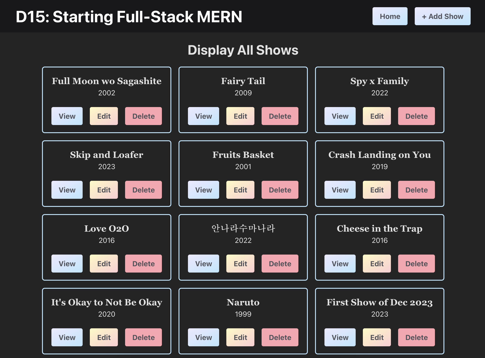
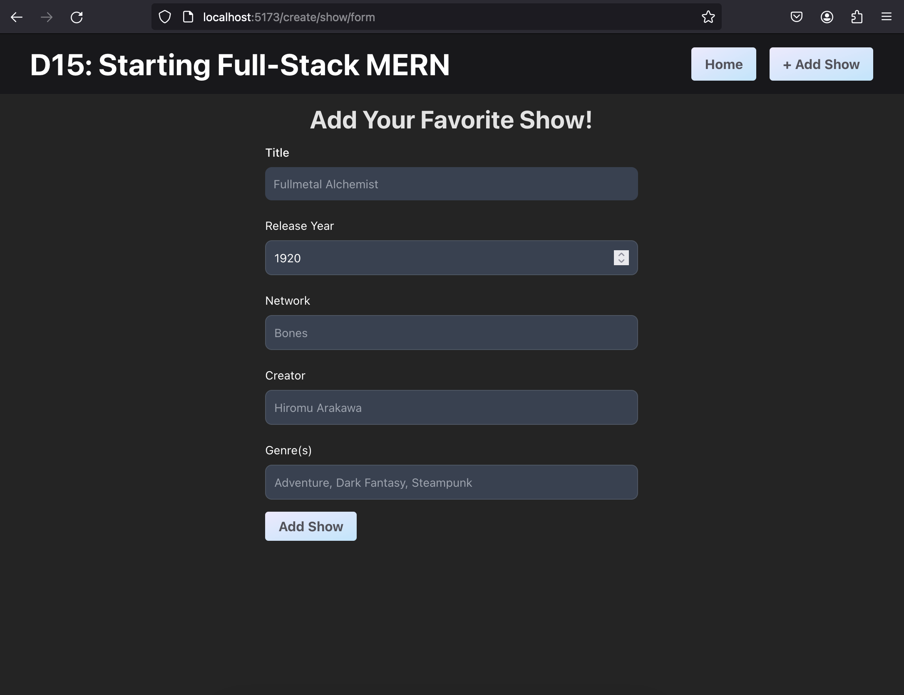
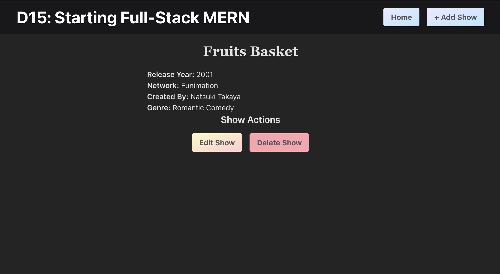

# D15: Starting a Full-Stack MERN Project

<div style="display: flex; justify-content: space-between;">
    <p>Week ６ Session １</p>
    <p>２０２４年０１月０１日（月）</p>
</div>

- [Project Initialization](#project-initialization)
- [Tailwind CSS Installation and Usage in a Vite React Project](#tailwind-css-installation-and-usage-in-a-vite-react-project)
- [Server Adjustments](#server-adjustments)
  - [Cross-Origin Resource Sharing (CORS) and its Necessity](#cross-origin-resource-sharing-cors-and-its-necessity)
- [ShowApp Components](#showapp-components)
  - [Main: `App.jsx`](#main-appjsx)
  - [1. `DisplayShows.jsx`](#1-displayshowsjsx)
  - [2. `CreateShowForm.jsx`](#2-createshowformjsx)
  - [3. `DisplayOneShow.jsx`](#3-displayoneshowjsx)
  <!-- ! NEW -->
  - [4. EditShowForm.jsx](#4-editshowformjsx)

## Project Initialization
For the project initialization, refer to the [D13-Server_Setup_w_Mongoose README](../D13-Server_Setup_w_Mongoose/README.md).

## Tailwind CSS Installation and Usage in a Vite React Project
To incorporate Tailwind CSS into a Vite React project, access the official Tailwind CSS documentation guide for Vite by visiting [Tailwind CSS - Vite](https://tailwindcss.com/docs/guides/vite).


## Server Adjustments

### **Cross-Origin Resource Sharing (CORS) and its Necessity**
When connecting a frontend and a backend that are hosted on different domains, web browsers enforce the Same-Origin Policy by default. This policy restricts web pages from making requests to a different domain than the one that served the web page. **CORS**, or Cross-Origin Resource Sharing, is a security feature implemented by web browsers to relax this restriction selectively.
```js
const cors = require("cors");
app.use( cors() );
```
In the context of your Express server, enabling CORS is crucial for the following reasons:

1. **Cross-Domain Requests:**
   - When your frontend, hosted on a domain A, makes a request to the backend, hosted on a domain B, the browser blocks the request due to the Same-Origin Policy. CORS provides a mechanism for the server on domain B to declare that it allows requests from domain A, thereby facilitating cross-domain communication.

2. **Preventing Security Issues:**
   - CORS is essential for security reasons. Allowing any domain to access your backend without restrictions could expose sensitive data or allow unintended actions. CORS headers enable you to specify which domains are permitted to access your backend resources, reducing the risk of security vulnerabilities.

3. **HTTP Headers:**
   - When you use `app.use(cors())`, it sets the necessary HTTP headers in the server's responses to inform the browser that cross-origin requests from certain domains are allowed. These headers include `Access-Control-Allow-Origin`, `Access-Control-Allow-Methods`, and others.

4. **Configuration Flexibility:**
   - CORS provides configuration options, allowing you to customize which origins, methods, and headers are permitted. This flexibility enables you to tailor the CORS policy according to your application's specific requirements.

By incorporating CORS into your Express server, you are explicitly stating which domains are allowed to access your backend resources, ensuring secure and controlled communication between the frontend and backend across different origins.


## ShowApp Components

### Main: `App.jsx`

This component serves as the main structure of the application, managing the overall layout, navigation, and routing. It organizes the different components responsible for displaying all shows, creating a new show, and displaying details of a single show. Here's what it includes:

1. **State Management:** The component uses the `useState` hook to manage state. `tvShows` is the state variable representing an array of TV shows, and `setTvShows` is the function to update this state.
    ```jsx
    import { useState } from 'react';
    
    // the state of tv shows is an array of objects
    const [tvShows, setTvShows] = useState([]);
    ```

3. **Header Section:** Displays a styled header (`HeaderStyled`) containing the application title as well as provides navigation links using `Link` from `react-router-dom` to navigate to the home page and the form for creating a new show.
    ```jsx
    import { BrowserRouter, Routes, Route, Link } from 'react-router-dom'
    // ...
    function App() {
        return(
            <>
                <BrowserRouter>
                    <HeaderStyled>
                        {/* <h1> */}
                        
                        <nav className="flex justify-center gap-4 mt-4 lg:mt-0">
                            <Link to={'/'}><Button>Home</Button></Link>
                            <Link to={"/create/show/form"}><Button>+ Add Show</Button></Link>
                        </nav>
                    </HeaderStyled>
                    
                    <Routes>
                        <Route />
                    </Routes>
                </BrowserRouter>
            </>
        )
    }
    ```

3. **Routing within `App.jsx`:** Routing is facilitated by `react-router-dom`, allowing the application to render different components based on the URL path. 
    The component is entirely wrapped with `BrowserRouter` to enable routing in the application. Furthermore, the `Routes` component contains different routes which specifies a path and the corresponding component to be rendered when the path is matched.
    ```jsx
    <div className='container mx-auto'>
        
        <Routes>
            <Route path='/' element={<DisplayShows tvShowsList={tvShows} setTvShowsList={setTvShows} />} />
            <Route path='/create/show/form' element={<CreateShowForm />} />
            <Route path='/view/show/:id' element={<DisplayOneShow />} />
        </Routes>
          
    </div>
    ```
    
    1. **`DisplayShows` Route:** The default route (`'/'`) renders the `DisplayShows` component, passing the `tvShows` state and the function to update it as props.
    
    2. **`CreateShowForm` Route:** The route `/create/show/form` renders the `CreateShowForm` component.
    
    3. **`DisplayOneShow` Route:** The route `/view/show/:id` renders the `DisplayOneShow` component. The `:id` in the path is a parameter representing the ID of the specific show to be displayed.


### 1. DisplayShows.jsx

<div align="center">

</div>

#### Imports:
```jsx
import React, { useEffect } from 'react';
import { Link } from 'react-router-dom'
import axios from 'axios'

import EditButton from './styles/EditButton.styled';
import DeleteButton from './styles/DeleteButton.styled';
import Button from './styles/Button.styled';
```

1. **React and useEffect:** The component is built using React, and it utilizes the `useEffect` hook for handling side effects like data fetching.

2. **Link:** `Link` is imported from `react-router-dom` to create navigation links that allow the user to move between different views within the application.

3. **axios:** The `axios` library is imported for making HTTP requests. In this case, it's used to fetch data from the backend API.

4. **Styled Components:** Several styled components (`EditButton`, `DeleteButton`, `Button`) are imported. These likely define the styling for buttons in the UI.


#### 1. Functional Component:
This component fetches data from the backend when it mounts using `useEffect` and `axios`. It renders a list of TV shows, and each show has buttons for viewing details and performing other actions. The state is lifted up to the parent component (`App.jsx`), allowing for centralized state management. The child component receives the state and a function to update it as props.

```jsx
const DisplayShows = ({ tvShowsList, setTvShowsList }) => {/* ... */}
```
1. **Props:** The component takes two props: `tvShowsList` and `setTvShowsList`. These are used for managing the state of the TV shows in the parent component (`App.jsx`). The list of TV shows is passed as a prop, and the function to update this list is also passed.

#### 2. `useEffect` Hook:

```jsx
useEffect(() => {
    axios.get('http://localhost:8000/api/shows')
        .then((response) => {
            console.log(response);
            setTvShowsList(response.data.shows);
        })
        .catch((error) => {
            console.log(error);
        });
}, []);
```
1. **Data Fetching:** The `useEffect` hook is used to perform side effects in the component. In this case, it's fetching data from the backend API.

2. **axios.get:** The `axios.get` method makes a GET request to the specified API endpoint (`http://localhost:8000/api/shows`).
  
3. **Promise Handling:** The `then` block handles the promise when it resolves. It logs the entire response and the data part of the response to the console.

4. **Setting State:** The `setTvShowsList` function is then used to update the state of TV shows with the data received from the backend. The data structure is assumed to be `{ shows: [...] }` based on the comments.

5. **Error Handling:** The `catch` block logs any errors that occur during the HTTP request.


#### 3. Component Rendering:
```jsx
return (
    <div className='text-center'>
        <h2 className='text-3xl font-bold my-5'>Display All Shows</h2>
        
        <div className='grid gap-4 sm:grid-cols-2 lg:grid-cols-3 xl:grid-cols-4'>
        {
            tvShowsList.map((show) => (
                <div key={show._id} className="pt-4 px-4 rounded-md border-2 border-sky-200">
                    <h3 className='text-xl font-bold font-serif hover:text-rose-200'>
                        { show.title }
                    </h3>
                    <p>{ show.releaseYear }</p>
                    <div className="mt-5 pb-4 flex justify-center gap-4">
                        <Link to={`/view/show/${show._id}`}>
                            <Button>View</Button>
                        </Link>
                        <EditButton>Edit</EditButton>
                        <DeleteButton>Delete</DeleteButton>
                    </div>
                </div>
            ))
        }
        </div>
    </div>
);
```

1. **UI Structure:** The component returns JSX that renders a section containing the header and a grid for displaying TV shows.

2. **Mapping Over Shows:** The `tvShowsList.map()` function is used to iterate over each TV show in the list.

3. **Show Details:** For each show, it renders a `div` containing the title, release year, and buttons for viewing, editing, and deleting.

4. **Navigation Link:** The `Link` component is used to create a navigation link to view the details of a specific show. It directs to the route `/view/show/:id` where `:id` is the unique identifier of the show.

5. **Styled Buttons:** Styled buttons (`Button`, `EditButton`, `DeleteButton`) are used for actions like viewing, editing, and deleting.


### 2. CreateShowForm.jsx

<div align="center">

</div>

This component is a form for creating a new TV show entry. It uses local state to manage the details of the new show and form validation errors. Input fields are controlled components, and changes trigger the `changeHandler` function to update the state. On form submission, it sends a POST request to the backend API to add the new show. There, it handles errors by displaying error messages (from the backend) below the corresponding input fields. Upon successful submission, it uses programmatic navigation to go back to the home page.


#### 1. Imports:
```jsx
import React, { useState } from 'react';
import axios from 'axios';
import { useNavigate } from 'react-router-dom';
```
1. **React and useState:** The component is built using React, and it uses the `useState` hook to manage local state.

2. **axios:** The `axios` library is imported for making HTTP requests. In this case, it's used to send data to the backend API.

3. **useNavigate:** `useNavigate` is a hook from `react-router-dom` used for programmatic navigation. It allows you to navigate to different views within the application.

#### 2. Functional Component:
```jsx
const CreateShowForm = ({ showList, setShowList }) => {
```
1. **Props:** The component takes two props: `showList` and `setShowList`. These are used for managing the state of the TV shows in the parent component (`App.jsx`). The list of TV shows is passed as a prop, and the function to update this list is also passed.

2. **Local State:** The component uses the `useState` hook to manage local state. It initializes the state with an object representing the details of a TV show, and an object for tracking form validation errors.

3. **Navigation:** The `useNavigate` hook is used to obtain the `navigate` function for programmatic navigation.

#### Event Handlers:
```jsx
const changeHandler = (e) => {
    setShow({ ...show, [e.target.name]: e.target.value });
}
```

- **Change Handler:** The `changeHandler` function is used to handle changes in form inputs. It updates the state by spreading the existing `show` object and setting the specified property (`[e.target.name]`) to the new value (`e.target.value`).


#### 3. Form Submission:
```jsx
const submitHandler = (e) => {
    e.preventDefault();
    // ... (omitting console logs for brevity)
    axios.post('http://localhost:8000/api/show/new', show)
        .then((response) => {
            console.log(response);
            navigate('/');
        })
        .catch((error) => {
            console.log(error);
            setErrors(error.response.data.errors);
        });
}
```

1. **Submit Handler:** The `submitHandler` function is triggered when the form is submitted. It prevents the default form submission behavior (`e.preventDefault()`).

2. **axios.post:** It uses `axios.post` to send a POST request to the backend API endpoint (`http://localhost:8000/api/show/new`). The `show` object is sent in the request body.

3. **Navigation:**
   - Upon successful submission, it logs the response and uses the `navigate` function to navigate back to the home page (`'/'`).

4. **Error Handling:** If there's an error, it logs the error and sets the `errors` state with the error messages received from the backend.


#### 4. Form Rendering:

1. **Form Structure:** The component returns JSX that renders a form with input fields for the user to input details of a TV show.

2. **Input Fields:** Each input field has a corresponding label and is controlled by state. The `onChange` event triggers the `changeHandler` function to update the state.

3. **Error Handling Display:** If there are errors for a specific field, it displays an error message below the corresponding input field.

4. **Submit Button:** The form has a submit button, and on submission, it triggers the `submitHandler` function.


### 3. DisplayOneShow.jsx

<div align="center">

</div>

This component fetches details of a specific TV show based on the `id` parameter from the URL. It uses local state to store the details of the show. The `useEffect` hook is used to trigger the API request when the component mounts, retrieving the show details to display in the JSX; buttons for editing and deleting the show are provided.

#### 1. Imports
```jsx
import axios from 'axios';
import React, { useEffect, useState } from 'react';
import { useParams } from 'react-router-dom';
import EditButton from './styles/EditButton.styled';
import DeleteButton from './styles/DeleteButton.styled';
```

1. **React, useEffect, useState:** The component is built using React and utilizes the `useEffect` and `useState` hooks for managing side effects and local state, respectively.

2. **axios:** The `axios` library is imported for making HTTP requests. In this case, it's used to fetch details of a single TV show from the backend API.

3. **useParams:** The `useParams` hook from `react-router-dom` is used to access parameters from the URL. In this case, it retrieves the `id` parameter from the route.

4. **EditButton and DeleteButton Components:** Components for styling buttons (`EditButton` and `DeleteButton`) are imported.


#### 2. Functional Component:
```jsx
const DisplayOneShow = () => {
    const { id } = useParams();
    console.log(`=== Show id: ${id} ===`);
    
    const [ show, setShow ] = useState({});
    
    useEffect(() => {
        axios.get(`http://localhost:8000/api/show/${id}`)
        .then((res) => {
            console.log(res);
            setShow(res.data.show);
        })
        .catch(err => console.log(err));
    }, []);
    // rest of the code is ommitted for brevity
}
```

1. **Route Parameter:** The `useParams` hook is used to extract the `id` parameter from the current route.

2. **Local State:** The component uses the `useState` hook to manage local state for the details of the TV show.

3. **useEffect:** The `useEffect` hook is used to fetch the details of the TV show from the backend API when the component mounts. It makes a GET request to the endpoint `http://localhost:8000/api/show/${id}`.

4. **Logging:** The retrieved data and the show's ID are logged to the console.

#### 3. Displaying Show Details:
1. **JSX Structure:** The component returns JSX that displays the details of the TV show.

2. **Conditional Rendering:** The details are conditionally rendered based on whether the `show` object has been populated.

3. **Show Actions:** Buttons for editing and deleting the show are displayed. These buttons are styled using the `EditButton` and `DeleteButton` components.


### 4. EditShowForm.jsx