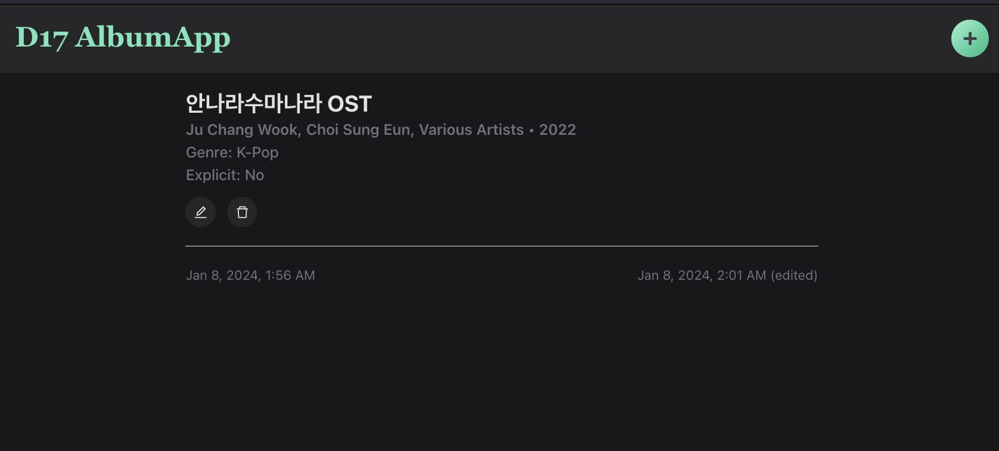

# D17: AlbumApp - Full-Stack MERN Project

<div style="display: flex; justify-content: space-between;">
    <p>Week 6 Session 2</p>
    <p>２０２４年０１月０２日（火）</p>
</div>

### Table of Contents
- [Project Initialization](#project-initialization)
- [Tailwind CSS Installation and Usage in a Vite React Project](#tailwind-css-installation-and-usage-in-a-vite-react-project)
- [AlbumApp Components](#albumapp-components)
    - [`DisplayAlbums.jsx`](#displayalbumsjsx)

## Project Initialization
For the project initialization, refer to the [D13-Server_Setup_w_Mongoose README](https://github.com/coderbri/MERN-Apr2023/blob/c09996835266cb9b75a5ff14c097fe49472fdf13/Wk4-Backend_Development/Lecture-Code/D13-Server_Setup_w_Mongoose/README.md) and for CORS implementation, go to this [project's README.md](https://github.com/coderbri/MERN-Apr2023/blob/f6efeda0fac558bd4b411f3d18c5a3ced068b783/Wk5-FullStack_MERN/Lecture-Code/D16-Full_CRUD_ShowApp/README.md).

<details>
<summary>Server Setup</summary>

- [**mongoose.config.js**](#mongooseconfigjs)
- [**album.model.js**](#albummodeljs)
- [**album.controller.js**](#albumcontrollerjs)
- [**album.routes.js**](#albumroutesjs)
- [**server.js**](#serverjs)

### `mongoose.config.js`

```js
const mongoose = require("mongoose");

mongoose.connect(`mongodb://localhost:27017/albums_mockExam`)
    .then(() => console.log("Established a connection to the database."))
    .catch((error) => console.log("Something went wrong when connecting to the database", error));
```

### `album.model.js`

```js
const mongoose = require("mongoose");

const AlbumSchema = new mongoose.Schema({
    albumName: {
        type: String,
        required: [ true, 'The Album Name is required '],
        minLength: [ 3, 'The Album Name must be 3 or more characters' ],
        maxLength: [ 50, 'The Album Name is too long' ]
    },
    artist: {
        type: String,
        required: [ true, 'The Artist\'s name is required '],
        minLength: [ 3, 'The Artist\'s name must be 3 or more characters' ],
        maxLength: [ 50, 'The Artist\'s name is too long' ]
    },
    releaseYear: {
        type: Number,
        required: [ true, 'The Release Year is required' ],
        min: [ 1920, 'No albums before 1920 allowed' ]
    },
    genre: {
        type: String,
        required: [ true, '' ],
        minLength: [ 3, 'The Genre must be 3 or more characters' ],
        maxLength: [ 50, 'The Genre is too long' ]
    },
    explicit: {
        type: Boolean,
        required: [ 'Please verified if this Album is explicit or not' ]
    }
}, { timestamps: true });

const Album = mongoose.model("Album", AlbumSchema);
module.exports = Album;
```


### `album.controller.js`
```js
const Album = require("../models/album.model");

module.exports = {
    findAllAlbumns: ( request, response ) => { // * READ (ALL)
        Album.find()
            .then((allAlbumData) => {
                console.log("\n=== All albums retrieved! ===\n", allAlbumData);
                response.json(allAlbumData);
            })
            .catch((err) => response.status(400).json(err));
    },
    
    createAlbum: (req, res) => { // * CREATE
        Album.create( req.body )
            .then((newAlbum) => {
                console.log("\=== Album created! ===\n", newAlbum);
                res.json(newAlbum);
            })
            .catch((err) => res.status(400).json(err));
    },
    
    findOneAlbum: (req, res) => { // * READ (ONE)
        Album.findOne({ _id: req.params.id })
            .then((oneSingleAlbum) => {
                console.log("\=== Album retrieved! ===\n", oneSingleAlbum);
                res.json(oneSingleAlbum);
            })
            .catch((err) => res.status(400).json(err));
    },
    
    updateOneAlbum: (req, res) => { // * UPDATE
        Album.findOneAndUpdate({ _id: req.params.id }, req.body, { new: true, runValidators: true})
            .then((updatedAlbum) => {
                console.log("\=== Album updated! ===\n", updatedAlbum);
                res.json(updatedAlbum);
            })
            .catch((err) => res.status(400).json(err));
    },
    
    deleteOneAlbum: (req, res) => { // * DELETE
        Album.deleteOne({ _id: req.params.id })
            .then((result) => {
                console.log("\=== Album deleted! ===");
                res.json({ albumStatus: result });
            })
            .catch((err) => res.status(400).json(err));
    },
}
```

### `album.routes.js`
```js
const AlbumController = require("../controllers/album.controller");

module.exports = app => {
    app.get( "/api/albums", AlbumController.findAllAlbumns ); // * READ (ALL)
    app.post( "/api/album/new", AlbumController.createAlbum ); // * CREATE
    app.get( "/api/album/:id", AlbumController.findOneAlbum ); // * READ (ONE)
    app.put( "/api/album/update/:id", AlbumController.updateOneAlbum ); // * UPDATE
    app.delete( "/api/album/delete/:id", AlbumController.deleteOneAlbum ); // * DELETE
}
```

### `server.js`
```js
const express = require('express');
const app = express();
const cors  = require("cors");

app.use(cors());
const port = 8000;

require("./config/mongoose.config");
app.use(express.json(), express.urlencoded({ extended:true }));

const AllAlbumRoutes = require("./routes/album.routes");
AllAlbumRoutes(app);

app.listen(port, ()=>console.log(`Listening on port: ${port}`));
```
</details>


## Tailwind CSS Installation and Usage in a Vite React Project
To incorporate Tailwind CSS into a Vite React project, access the official Tailwind CSS documentation guide for Vite by visiting [Tailwind CSS - Vite](https://tailwindcss.com/docs/guides/vite).


## AlbumApp Components

**Using `BrowserRouter` in Main.jsx**: `BrowserRouter` can also be imported to `Main.jsx` for cleaner modularization of `App.jsx`’s components.
```jsx
// other imports removed for brevity
import { BrowserRouter } from 'react-router-dom'
import './index.css'

ReactDOM.createRoot(document.getElementById('root')).render(
  <React.StrictMode>
    <BrowserRouter>
      <App />
    </BrowserRouter>
  </React.StrictMode>,
)
```

### `App.jsx`
This component serves as the main structure of the application, managing the overall layout, navigation, and routing. It organizes the different components responsible for displaying all albums, creating a new album, and displaying details of a single album. Here's what it includes:

1. **State Management**: The component uses the useState hook to manage state. Albums in the state variable represent an array of Products, and setProducts is the function to update this state.
    ```javascript
    import { useState } from 'react';
    
    const [ albumCollection, setAlbumCollection ] = useState([]);
    ```

2. **Header Section**: Displays a styled header (`HeaderStyled`) containing the application title as well as provides navigation links using `Link` from `react-router-dom` to navigate to the home page and the form for creating a new album.
    ```javascript
    import { BrowserRouter, Routes, Route, Link } from 'react-router-dom'
    {/* App function removed for brevity... */}
    <>
        <HeaderStyled>
            <h1 className='text-3xl font-bold font-serif text-emerald-300'>
            <a href="/">D17 AlbumApp</a>
            </h1>
            <Link to={"/album/create"}>
            <AddButtonStyled />
            </Link>
        </HeaderStyled>
        
        {/* Routes... */}
    </>
    ```

3. **Routing within `App.jsx`**: Routing, facilitated by `react-router-dom`, allows the application to render different components based on the URL path. The component is entirely wrapped with `BrowserRouter` to enable routing in the application. Furthermore, the `Routes` component contains different routes which specifies a path and the corresponding component to be rendered when the path is matched.
   ```jsx
    <Routes>
        <Route path={"/"} element={<DisplayAlbums albumList={albumCollection} setAlbumList={setAlbumCollection} />} />
        <Route path={"/album/:id/view"} element={<DisplayOneAlbum />} />
        <Route path={"/album/create"} element={<CreateAlbumForm />} />
        <Route path={"/album/:id/edit"} element={<EditAlbumForm />} />
    </Routes>
   ```

4. **Component Route**: Contains the components that will display the relevant album data as well as pass the necessary the album state and the function to update it as props.


### `DisplayAlbums.jsx`

<div align="center">

</div>

#### Imports
```javascript
import React, { useEffect } from 'react';
import axios from 'axios'
import { Link } from 'react-router-dom'
import EditButton from './styles/EditButton';
import DeleteButton from './styles/DeleteButton';
```
1. **React and useEffect:** The component is built using React, and it utilizes the `useEffect` hook for handling side effects like data fetching.

2. **Link:** (Imported from `react-router-dom`) is used to create navigation links that allow the user to move between different views within the application.

3. **axios:** This library is imported for making HTTP requests. In this case, it's used to fetch data from the backend API.

4. **Styled Components:** Several styled components (`EditButton` and `DeleteButton`) are imported. These define the styling for buttons in the UI.

#### Component Setup

After the data from the backend is fetched, it is mounted to the component using `useEffect` and `axios` to render a collection of albums with stylized buttons to edit and delete entries as well as a Link to the title to access each album’s personal view page. The state is lifted up to the parent component (`App.jsx`), allowing for centralized state management. The child component receives the state and a function to update it as props.

1. **Props**: The component takes two destructured props: `albumList` and `setAlbumList`. These are used for managing the state of albums in the parent component (`App.jsx`). The list of products is passed as a prop, and the function to update this list is also passed.
   ```javascript
   const DisplayAlbums = ({ albumList, setAlbumList }) => {/* ... */}
   ```

2. **`useEffect` Hook**:
   ```javascript
   useEffect(() => {
        axios.get("http://localhost:8000/api/albums")
            .then((res) =>{
                console.log("=== All albums loaded:", res);
                setAlbumList(res.data);
            })
            .catch((err) => console.log(err));
    }, []);
   ```
   1. **Data Fetching:** The `useEffect` hook is used to perform side effects in the component. In this case, it's fetching data from the backend API.
   2. **`axios.get`**: This method makes a GET request to the specified API endpoint (http://localhost:8000/api/albums).
   3. **Promise Handling:** The then block handles the promise when it resolves. It logs the entire response and the data part of the response to the console.
   4. **Setting State:** The `setAlbumList` function is then used to update the state of managed products with the data received from the backend. The data structure can be assumed to be { albums: [...] }.
   5. **Error Handling:** The catch block logs any errors that occur during the HTTP request.

3. **Component Rendering**
    ```jsx
    return (
        <div>
            <h2 className='text-3xl font-bold text-center'>All Albums</h2>
            <div className='mt-4 grid gap-4 sm:grid-cols-2 lg:grid-cols-3 xl:grid-cols-4'>
                { albumList.map((album) => (
                    <div key={album._id} className='p-4 rounded-lg bg-zinc-800'>
                        <p>test</p>
                        <hr />
                        <div className="mt-3 flex flex-col align-bottom truncate">
                            <Link to={`/album/${album._id}/view`} className="ease-out duration-200 hover:text-emerald-300 hover:font-extrabold">
                                <h3 className='font-semibold'>{ album.albumName }</h3>
                            </Link>
                            <p className='text-zinc-500 font-medium'>{ album.artist }</p>
                            <div className="flex justify-end">
                                <div className="flex items-center gap-3">
                                    <Link to={`/album/${album._id}/edit`}><EditButton /></Link>
                                    <DeleteButton onClick={() => deleteHandler(album._id)} />
                                </div>
                            </div>
                        </div>
                    </div>
                ))}
            </div>
        </div>
    );
    ```
    1. **UI Structure:** The component returns JSX that renders a section containing the header and a grid for displaying a collection of albums.
    
    2. **Mapping Over Products:** The `albumList.map()` function is used to iterate over each album in the array.
    
    3. **Product Details:** For each product, it renders a `div` containing the name of the album, its artist, a link for viewing, and buttons for editing, and deleting.
    
    4. **Navigation Link:** The `Link` component is used to create a navigation link to view the details of a specific album. It directs to the route `/album/:id/view` where `:id` is the unique identifier of the album.


### `DisplayOneAlbum.jsx`

<div align="center">

</div>

This component fetches details of a specific album (stored using local state) based on the `id` parameter from the URL. The `useEffect` hook is then used to trigger the API request when the component mounts, retrieving the album’s details to display in the JSX.

#### Imports:
```javascript
import axios from 'axios';
import React, { useEffect, useState } from 'react';
import { Link, useNavigate, useParams } from 'react-router-dom';
import EditButton from './styles/EditButton';
import DeleteButton from './styles/DeleteButton';
import { formatDate } from '../utils/dateUtils';
```
1. **React, `useEffect`, and `useState`**: The component is built using React and utilizes the `useEffect` and `useState` hooks for managing side effects and local state, respectively.

2. **axios**: This library is imported for making HTTP requests to fetch details of a specific album from the backend API.

3. **`Link`, `useNavigate`, and `useParams`**: The `useParams` hook from `'react-router-dom'` is used to access the `id` parameter from the URL.

4. **Styled Components**: These customized styled components are imported to create a more intuitive UI for users to edit and delete album entries.

5. **`formatDate` Utility**: Located in **utils directory** in the **src/** folder. This is imported to format the date in a consistent user-friendly manner to see `createdAt` and `updatedAt` dates.

#### Component Setup:
```javascript
const DisplayOneAlbum = () => {
    const [ albumDetails, setAlbumDetails ] = useState({});
    const { id } = useParams();
    const navigate = useNavigate();
    
    useEffect(() => {
        axios.get(`http://localhost:8000/api/album/${id}`)
            .then((res) => {
                console.log("=== Album Details loaded:", res);
                setAlbumDetails(res.data);
            })
            .catch((err) => console.log(err));
    }, []);
    
    const deleteHandler = (id) => {
        axios.delete(`http://localhost:8000/api/album/delete/${id}`)
            .then((res) => {
                console.log("=== Album deleted!", res);
                navigate("/");
            })
            .catch(err => console.log(err));
    }
	// Rest of the component removed for brevity...
}
```
1. **Route Parameter**: As mentioned above, the `useParams` hook is used to extract the id parameter from the current route.

2. **Local State**: The component then uses the **`useState` hook** to manage the local state for the album’s details.

3. **useEffect Hook**: Using the `id` parameter, the **`useEffect` hook** fetches the album’s details from the backend API when the component mounts. It makes a GET request to the endpoint: [http://localhost:8000/api/album/:id](#).

4. **`deleteHandler()` Function**: This function will handle the deletion of an album in this page by using the `id` paramter from the URL to then access the backend API endpoint: [http://localhost:8000/api/album/delete/:id](#). Sucessful deletion will navigate the user to the app's home page.

#### Rendering Album Details
1. **JSX Structure**: The component returns JSX that displays the details of the product.

2. **Conditional Rendering**: The details are conditionally rendered based on whether the product has been populated.

3. **Album Actions**: Buttons for editing and deleting the product are displayed. These buttons are styled using imported styled components.


### `CreateAlbumForm.jsx`

<div align="center">

</div>

This component is a form for creating a new album entry. It uses local state to manage the details of the new album and form validation errors. Input fields are controlled components, and changes trigger the `changeHandler` function to update the state. On form submission, it sends a POST request to the backend API to add the new album. There, it handles errors by displaying error messages (from the backend) below the corresponding input fields. Upon successful submission, it uses programmatic navigation to go back to the home page.

#### Imports
```javascript
import axios from 'axios';
import React, { useState } from 'react';
import ButtonStyled from './styles/Button.styled';
import { useNavigate } from 'react-router-dom';
```
1. **React and `useState`**: The component is built using React and it uses the `useState` hook to locally manage the new album’s state.

2. **`axios`**: This library is imported to make an HTTP request to send data to the backend API via POST.

3. **`useNavigate`**: This hook from `‘react-router-dom’` is used to navigate the user from the form view to the homepage after successful album creation.

#### Form State and Event Handlers
```javascript
const [ album, setAlbum ] = useState({
	albumName: "",
	artist: "",
	releaseYear: 1920,
	genre: "",
	explicit: false
})
const [ errors, setErrors ] = useState({});
```

1. **Local State Management:** The component uses the `useState` hook to manage local state in the following matter: (1) It initializes the state with an object representing the details of an album, and (2) an object for tracking form validation errors.

2. **Change Handler:** This function handles changes in form inputs. It updates the state by spreading the existing album object and setting the specified property (`[e.target.name]`) to the new value (`e.target.value`).
    ```javascript
    const changeHandler = (e) => {
            const value = e.target.type === 'checkbox' ? e.target.checked : e.target.value;
            setAlbum({ ...album, [e.target.name]: value });
        };
    ```

3. **Submit Handler**: This function is triggered when the form is submitted. It first prevents the default form submission behavior (`e.preventDefault()`). 
    ```javascript
    const navigate = useNavigate('/');
    const submitHandler = (e) => {
            e.preventDefault();
            axios.post(`http://localhost:8000/api/album/new`, album)
                .then((res) => {
                    console.log("Album created:", res);
                    navigate('/');
                })
                .catch((err) => {
                    console.log(err);
                    setErrors(err.response.data.errors);
                });
        }
    ```
   1. The `axios` library is then used to make a POST request to the backend API endpoint ([http://localhost:8000/api/album/new](http://localhost:8000/api/album/new)). The `album` object is sent in the request body.
   
   2. Upon successful submission the response is logged and uses the navigate function to navigate back to the home page ('/').
   
   3. If there's an error, it logs the error and sets the errors state with the error messages received from the backend.

#### Form Rendering
1. **Form Structure**: The component returns JSX that renders a form with input fields for the user to input details of an album.

2. **Input Fields**: Each input field has a corresponding label and is controlled by state. The `onChange` event triggers the `changeHandler` function to update the state.

3. **Error Handling**: If there are errors for a specific field, it displays an error message below the corresponding input field.

4. **Submit Button**: The form has a submit button, and on submission, it triggers the `submitHandler` function.


### `EditAlbumForm.jsx` _wip_

<div align="center">

</div>

### Delete Handler _wip_