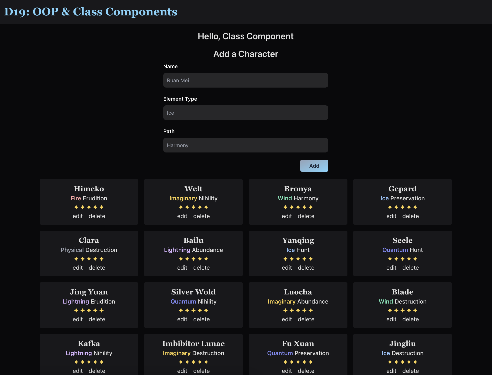

# D18: Object-Oriented Programming (OOP) in JavaScript & Class Components

<div style="display: flex; justify-content: space-between;">
    <p>Week 7 Session 1</p>
    <p>２０２４年０１月１０日（水）</p>
</div>


### Table of Contents
- [Basic OOP Setup](#basic-oop-setup)
    - [Inheritance - A Pillar of OOP](#inheritance---a-pillar-of-oop)
- Class Components in React
    - Setup
    - Setting up State


## Basic OOP Setup

1. In a `class.js` file, create a class called `Human`. Classes are always defined in **PascalCase**.

    ```js
    class Human {}
    ```

2. Always have a constructor. A constructor is a method (function) that creates the instances of a class. Then the values are assigned using **`this`**.

    ```js
    class Human {
        constructor( attribute1, attribute2 ) {
            this.attribute1 = attribute1;
            this.attribute2 = attribute2;
        }
    }
    ```

3. Then we define methods, which are functions in a class. This goes after the constructor.

    ```js
    class Human {
        constructor( attribute1, /*...*/ ) {
            this.attribute1 = attribute1;
            /*...*/
        }
        
        helloWorld() {
            console.log(`Hello World! It's ${this.attribute1}!`);
        }
    }
    ```

4. Now we can make an instance of the class. Logging this will return the whole class object.

    ```js
    const exampleOne = new Human( 'Tutorial' );
    console.log(exampleOne); // Human { attribute1: 'Tutorial' }
    ```

    We can call instances with methods too.

    ```js
    exampleOne.helloWorld(); // Hello World! It's Tutorial!
    ```


### Inheritance - A Pillar of OOP

**Inheriting from a Parent class.** At times we may have a class that’s generic, and the other classes we make may share similar attributes to that other class. To avoid redundancy, we can inherit everything from that generic class and add any special attributes to that new class.

- In the new Student class, students share attributes similar to the Human class. So we can inherit those attributes by extending the Student class from the Human (now Parent) class.

    ```js
    class Student extends Human {}
    ```

- We define the constructor as normal, including the attributes that we’re inheriting. But within the constructor, we use the `super()` keyword. **`super()`** is how we can inherit the attributes that have already been defined by the Parent.

    ```js
    class Student extends Human {
        constructor( name, hairColor, currentStack ) {
            super( name, hairColor );
            this.currentStack = currentStack;
        }
        // methods for Student class go here
    }
    ```

- For methods created within the Student class, they will ONLY work for instances defined as Student and not as the class it's inheriting. But instances of the Student class CAN inherit methods from the Parent class, Human.

## Class Components in React

<div align="center">

</div>

### Setup

1. Import Component into `App.jsx`:

    ```js
    import React, { Component } from 'react';
    ```

2. Replace `function` in function `App() {}` with the following:

    ```js
    class App extends Component {
        render() {
            return (/*...*/);
        }
    }
    ```

    Functions will no longer be used in React apps built with Class Components. So this change is necessary. The following, `extends Component`, is needed since ***all*** class components stem from the base component class in React.

3. The `return()` function will be within the **render method** `render(){}`:

    ```js
    render() {
        return (/*...*/);
    }
    ```

### Setting up State

Hooks like `useState` and `useEffect` don’t work in class components. They are used in functional components. So to set state using class components, `state` is defined similiarily as would `axios`. It has to be written as **`state`** and no other variable.
```js
state = { arrayExampleInState: [{}] }
render() {}
```
Let's see how class components using state are set up:

1. **Import Statement**: `React` and `Component` are imported from 'react' to define and use React components.
    ```jsx
    import React, { Component } from 'react';
    ```


2. **Class Component Definition:**

    ```jsx
    class App extends Component {
      // State goes here!
      state = {
        fiveStarCharacters: [
          // ... (character data remains unchanged)
        ]
      }
    
      render() {
        return (
          <>
            {/* JSX content */}
          </>
        )
      }
    }
    ```

    - `App` is defined as a class component that extends `Component` from React.
    - The `state` property is initialized with an array of `fiveStarCharacters`, each representing a character with properties like `name`, `elementType`, `path`, and `owned`.
    - The `render` method is where the component's JSX content is defined and returned.

3. **JSX Content:**

    ```jsx
    <>
      <HeaderStyled>
        <h1 className='text-3xl font-bold font-serif text-sky-400 dark:text-sky-300'>D19: OOP & Class Components</h1>
      </HeaderStyled>
      
      <div className="container mx-auto">
        <h2 className="text-2xl font-semibold text-center my-4">Hello, Class Component</h2>
        
        <div className="grid gap-4 sm:grid-cols-2 lg:grid-cols-3 xl:grid-cols-4">
          {/* Mapping through fiveStarCharacters array */}
          {
            this.state.fiveStarCharacters.map((chara, idx) => {
              // Define Tailwind CSS class based on elementType for each character
              const textColorClass = chara.elementType === "Physical" ? "text-gray-500 dark:text-gray-400"
                : chara.elementType === "Fire" ? "text-red-700 dark:text-red-300"
                : chara.elementType === "Ice" ? "text-sky-500 dark:text-blue-300"
                : chara.elementType === "Lightning" ? "text-purple-600 dark:text-purple-300"
                : chara.elementType === "Wind" ? "text-emerald-500 dark:text-emerald-300"
                : chara.elementType === "Quantum" ? "text-indigo-600 dark:text-indigo-400"
                : chara.elementType === "Imaginary" ? "text-yellow-500 dark:text-amber-300"
                : "text-black";
              
              return (
                <div key={idx} className="border border-none rounded text-center p-3 bg-slate-50 dark:bg-zinc-900">
                  <h3 className="text-xl font-semibold font-serif">{chara.name}</h3>
                  <p className="font-medium">
                    <span className={`font-semibold ${textColorClass}`}>{chara.elementType}</span> {chara.path}
                  </p>
                  <p className="text-amber-300">✦ ✦ ✦ ✦ ✦</p>
                  
                  <div className="flex items-center justify-center gap-4">
                    <button>edit</button>
                    <button>delete</button>
                  </div>
                </div>
              );
            })
          }
        </div>
      </div>
    </>
    ```

    - The content is wrapped in a fragment (`<>...</>`) to avoid unnecessary div wrappers in the DOM.
    - `HeaderStyled` is a styled component, displaying a styled header with a specific text.
    - A container with a title and a `CreateCharacterForm` component is present.
    - The `fiveStarCharacters` array is mapped to create a set of UI elements for each character.
    - The character's name, element type, path, and buttons for editing and deleting are displayed.

This setup follows the class component structure in React and utilizes state to manage the list of characters. The `map` function is used for dynamic rendering based on the data in the state. Tailwind CSS classes are dynamically assigned based on the `elementType` of each character for styling.