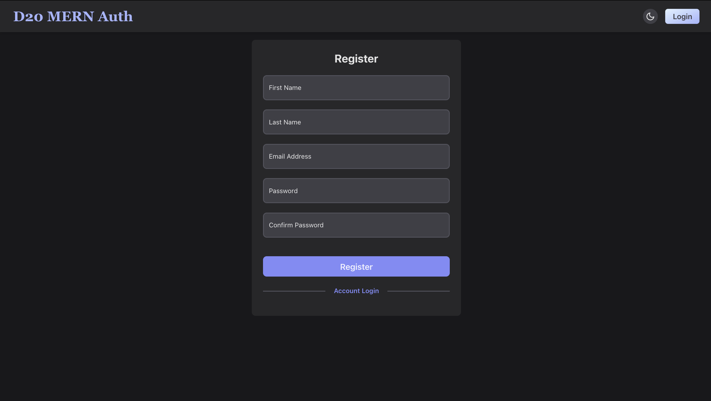
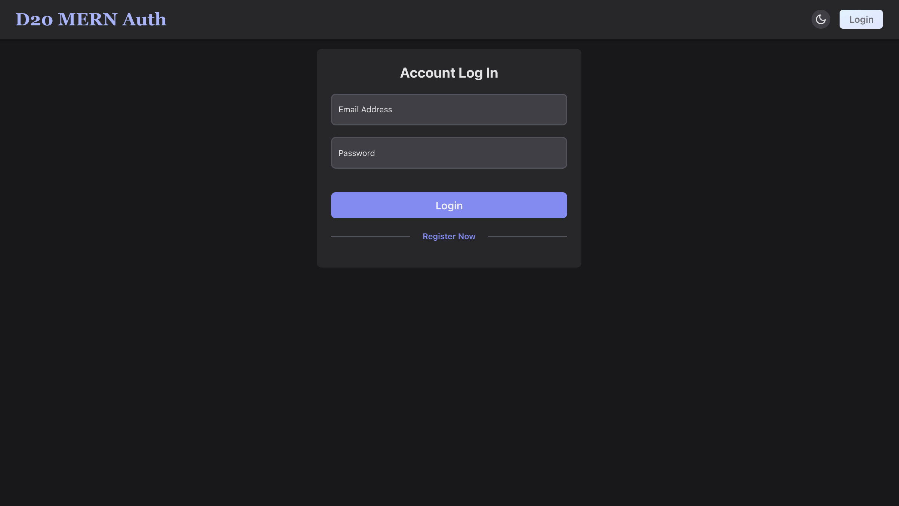
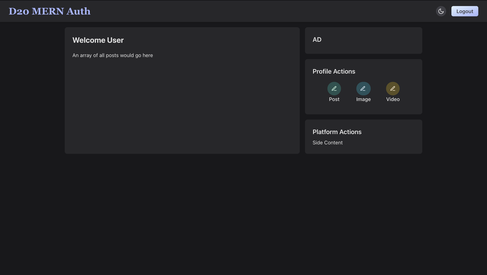

# D20: Intro to MERN Auth: Login and Registration, Part II

<div style="display: flex; justify-content: space-between;">
    <p>Week 7 Session ３</p>
    <p>２０２４年０１月１８日（木）</p>
</div>

### Table of Contents
- [Project Initialization](#project-initialization---server-setup)
- [Tailwind CSS Installation and Usage in a Vite React Project](#tailwind-css-installation-and-usage-in-a-vite-react-project)
- [Client Setup](#client-setup)
    - [App.jsx](#appjsx)
        - [Dark Mode Toggling (SwitchLightDarkModeBtn Component and App Component)](#dark-mode-toggling-switchlightdarkmodebtn-component-and-app-component)
        - [Logout Logic (`handleUserLogout` Function))](#logout-logic-handleuserlogout-function)
    - [Register Form (RegisterForm Component):](#register-form-registerform-component)
    - [Login Form (LoginForm Component):](#login-form-loginform-component)
    - [User Dashboard (Dashboard.jsx Component)](#user-dashboard-dashboardjsx-component)
- [Summary](#summary)
<!--
    - [Packages Needed](#packages-needed)
-->

## Project Initialization - Server Setup
For the project initialization, refer to the [D19-Login_and_Registration_Part_I README](https://github.com/coderbri/MERN-Apr2023/blob/f26918afad9783381e986964a23a2e97a4a7b152/Wk7-MERN_Auth/Lecture-Code/D19-Login_and_Registration_Part_I/README.md) and for CORS implementation, go to this [project's README.md](https://github.com/coderbri/MERN-Apr2023/blob/f6efeda0fac558bd4b411f3d18c5a3ced068b783/Wk5-FullStack_MERN/Lecture-Code/D16-Full_CRUD_ShowApp/README.md).

## Tailwind CSS Installation and Usage in a Vite React Project
To incorporate Tailwind CSS into a Vite React project, access the official Tailwind CSS documentation guide for Vite by visiting [Tailwind CSS - Vite](https://tailwindcss.com/docs/guides/vite).

# Client Setup

## App.jsx

### 1. Dark Mode Toggling (SwitchLightDarkModeBtn Component and App Component)

#### **SwitchLightDarkModeBtn Component:**
```jsx
import React from 'react';

const SwitchLightDarkModeBtn = ({ isDarkMode, toggleDarkMode }) => {
    return (
        <button
            className={`text-xl p-1.5 rounded-full ${
                isDarkMode
                    ? 'dark:bg-zinc-700 dark:hover:bg-zinc-600'
                    : 'bg-zinc-200 hover:bg-zinc-300'
            }`}
            onClick={toggleDarkMode}
        >
            {isDarkMode
                ? <svg>{/* SVG for dark mode */}</svg>
                : <svg>{/* SVG for light mode */}</svg>
            }
        </button>
    );
}

export default SwitchLightDarkModeBtn;
```

#### 2. **App Component:**
```jsx
import { useState, useEffect } from 'react';
import SwitchLightDarkModeBtn from './components/styles/SwitchLightDarkModeBtn.styled';

function App() {
    const [isDarkMode, setIsDarkMode] = useState(() => localStorage.getItem('darkMode') === 'true');
    
    useEffect(() => {
        const root = document.documentElement;
        root.setAttribute('data-theme', isDarkMode ? 'dark' : 'light');
        localStorage.setItem('darkMode', isDarkMode);
    }, [isDarkMode]);
    
    const toggleDarkMode = () => {
        setIsDarkMode((prevMode) => !prevMode);
    }
    
    // ... rest of the code
    
    return (
        <>
            {/* ... */}
            <SwitchLightDarkModeBtn isDarkMode={isDarkMode} toggleDarkMode={toggleDarkMode} />
            {/* ... */}
        </>
    )
}

export default App;
```

#### Explanation:

1. **SwitchLightDarkModeBtn Component:**
   - This component receives two props: `isDarkMode` and `toggleDarkMode`.
   - The button's style is determined by the `isDarkMode` prop, changing its background and hover styles accordingly.
   - The button displays different SVG icons based on the `isDarkMode` state.

2. **App Component:**
   - Manages the state `isDarkMode` and initializes it based on the value stored in local storage.
   - Uses the `useEffect` hook to update the HTML attribute and local storage whenever `isDarkMode` changes.
   - Provides a `toggleDarkMode` function to be passed down to the `SwitchLightDarkModeBtn` component.
   - Renders the `SwitchLightDarkModeBtn` component, passing the current `isDarkMode` state and the `toggleDarkMode` function.

This setup ensures that the UI reflects the dark/light mode state, and the user's preference is persisted across page reloads using local storage. Clicking the button triggers the `toggleDarkMode` function, updating the state and, consequently, the UI.


### Logout Logic (`handleUserLogout` Function)

#### **`handleUserLogout` Function (App Component):**
```jsx
// ... (imports)

function App() {
    // ... (other state variables)
    
    const handleUserLogout = () => {
        axios.post('http://localhost:8000/api/logout/user', {}, { withCredentials: true })
            .then((res) => {
                // If the logout request is successful:
                setIsLoggedIn(false);  // Set isLoggedIn state to false
                navigate('/login');    // Redirect to the login page
            })
            .catch(err => console.log(err));
    }
    
    // ... (rest of the code)
    
    return (
        <>
            {/* ... (other components) */}
            <Button onClick={isLoggedIn ? handleUserLogout : () => navigate('/login')}>
                {isLoggedIn ? 'Logout' : 'Login'}
            </Button>
            {/* ... (other components) */}
        </>
    )
}

export default App;
```

#### Explanation:

1. **`handleUserLogout` Function:**
   - This function is responsible for handling the user logout process.
   - It uses the `axios.post` method to send a POST request to the server's logout endpoint (`http://localhost:8000/api/logout/user`).
   - The empty object `{}` is passed as the data payload, and `{ withCredentials: true }` is included in the configuration to ensure that cookies are sent with the request for authentication.
   - If the logout request is successful (HTTP status 200), the following actions are performed:
     - `setIsLoggedIn(false)`: Sets the `isLoggedIn` state to `false`, indicating that the user is no longer logged in.
     - `navigate('/login')`: Uses the `useNavigate` hook to navigate to the login page.
   - If an error occurs during the logout request, it is logged to the console.

2. **Integration in App Component:**
   - The `handleUserLogout` function is used as the `onClick` handler for a button (presumably a logout button).
   - The button's label is dynamically set based on the `isLoggedIn` state. If the user is logged in, the button displays "Logout"; otherwise, it displays "Login".
   - When the button is clicked, the appropriate action (logout or navigate to the login page) is triggered based on the `isLoggedIn` state.

#### Overall Flow:
   - When the user clicks the logout button, the `handleUserLogout` function is invoked.
   - The function sends a request to the server to log the user out.
   - If successful, the local state is updated (`setIsLoggedIn(false)`), and the user is redirected to the login page.
   - If there's an error during the logout process, it is logged to the console.

This structure ensures a smooth and secure user logout experience in your MERN authentication application.


## Register Form (RegisterForm Component):

<div align="center">

</div>

#### 1. **RegisterForm Component:**
```jsx
import React, { useState } from 'react';
import { Link, useNavigate } from 'react-router-dom';
import axios from 'axios';

const RegisterForm = ({ isDarkMode, setIsLoggedIn }) => {
    // State for user input and form errors
    const [user, setUser] = useState({
        firstName: "",
        lastName: "",
        email: "",
        password: "",
        confirmPassword: ""
    });
    const [errors, setErrors] = useState({});

    // Event handler for input changes
    const changeHandler = (e) => {
        setUser({ ...user, [e.target.name]: e.target.value });
    }

    // Event handler for form submission
    const submitHandler = (e) => {
        e.preventDefault();

        // Sending a POST request to register a new user
        axios.post('http://localhost:8000/api/register/user', user, { withCredentials: true })
            .then((res) => {
                setIsLoggedIn(true);  // Set user as logged in
                navigate('/dashboard');  // Redirect to the dashboard after successful registration
            })
            .catch((err) => {
                setErrors(err.response.data.errors);  // Set errors if registration fails
            });
    }

    return (
        // ... (JSX for the registration form)
    );
}

export default RegisterForm;
```

### Explanation (Register Form):

1. **State Management:** The component uses the `useState` hook to manage the state for user input (`user` object) and form errors (`errors` object).

2. **Input Change Handling:** The `changeHandler` function updates the `user` state as the user types into the registration form.

3. **Form Submission:**
   - The `submitHandler` function is triggered when the user submits the registration form.
   - It sends a POST request to the server endpoint (`http://localhost:8000/api/register/user`) with the user data.
   - If the registration is successful (HTTP status 200), the user is set as logged in (`setIsLoggedIn(true)`) and redirected to the dashboard.
   - If there are errors during registration, the errors are set in the `errors` state.

## Login Form (LoginForm Component):

<div align="center">

</div>

#### 2. **LoginForm Component:**
```jsx
import React, { useState } from 'react';
import { Link, useNavigate } from 'react-router-dom';
import axios from 'axios';

const LoginForm = ({ isDarkMode, setIsLoggedIn }) => {
    // State for user input and form errors
    const [user, setUser] = useState({
        email: "",
        password: "",
    });
    const [errors, setErrors] = useState({});

    // Event handler for input changes
    const changeHandler = (e) => {
        setUser({ ...user, [e.target.name]: e.target.value });
    }

    // Event handler for form submission
    const submitHandler = (e) => {
        e.preventDefault();

        // Sending a POST request to log in the user
        axios.post('http://localhost:8000/api/login/user', user, { withCredentials: true })
            .then((res) => {
                setIsLoggedIn(true);  // Set user as logged in
                navigate('/dashboard');  // Redirect to the dashboard after successful login
            })
            .catch((err) => {
                setErrors(err.response.data);  // Set errors if login fails
            });
    }

    return (
        // ... (JSX for the login form)
    );
}

export default LoginForm;
```

### Explanation (Login Form):

1. **State Management:** Similar to the Register Form, the component uses the `useState` hook to manage the state for user input (`user` object) and form errors (`errors` object).

2. **Input Change Handling:** The `changeHandler` function updates the `user` state as the user types into the login form.

3. **Form Submission:**
   - The `submitHandler` function is triggered when the user submits the login form.
   - It sends a POST request to the server endpoint (`http://localhost:8000/api/login/user`) with the user's login credentials.
   - If the login is successful (HTTP status 200), the user is set as logged in (`setIsLoggedIn(true)`) and redirected to the dashboard.
   - If there are errors during login, the errors are set in the `errors` state.

### Overall Flow:
   - The Register Form and Login Form components handle user input, validate credentials, and manage form errors.
   - Upon successful registration or login, the user is set as logged in (`setIsLoggedIn(true)`) and redirected to the dashboard.
   - Any errors during the


## User Dashboard (Dashboard.jsx Component)

<div align="center">

</div>

The `Dashboard` component you provided is responsible for rendering the user dashboard, and it includes various sections for displaying posts, advertisements, and profile/platform actions. Let's break down the key elements and how they contribute to user validation and interaction:

#### Explanation:

1. **Welcome Section:** The component includes a welcome section for greeting the user.

2. **Posts Section:** Inside the large rounded box, there is a placeholder message for where an array of all posts would be displayed. The actual implementation of fetching and displaying posts is not provided in this component. Typically, you would fetch user-specific data from the backend here.

3. **Profile and Platform Actions:**
   - The right side of the dashboard contains various actions (for demo purposes, not actually functional) like creating a post, uploading an image, and uploading a video. These actions are represented by clickable icons.


#### User Authentication for Registration, Login and Logout
1. When a user registers or logs in, a request is made to the backend `registerUser` or `loginUser` endpoint. 
2.  For registration, the backend checks if the email already exists. If not, it creates a new user in the database.
3. For login, the backend checks if the user exists and if the entered password matches the stored hash.
4. If the user is created successfully or the existing user is validated, a JWT (JSON Web Token) is generated, and it's stored as an HTTP-only cookie on the client side ('userToken').
5.  When a user logs out, a request is made to the backend logoutUser endpoint.
The backend clears the 'userToken' cookie.

## Summary

In summary, this project is a comprehensive full-stack application centered around user authentication and a dynamic dashboard experience. Leveraging React for the frontend, Node.js and Express for the backend, and MongoDB for data storage, the application ensures secure user registration and login processes. Notable features include a responsive dashboard enabling users to create posts, upload images, and share videos. The implementation also embraces a modern and accessible design with support for both light and dark modes. Utilizing JWTs stored as HTTP-only cookies enhances session security.