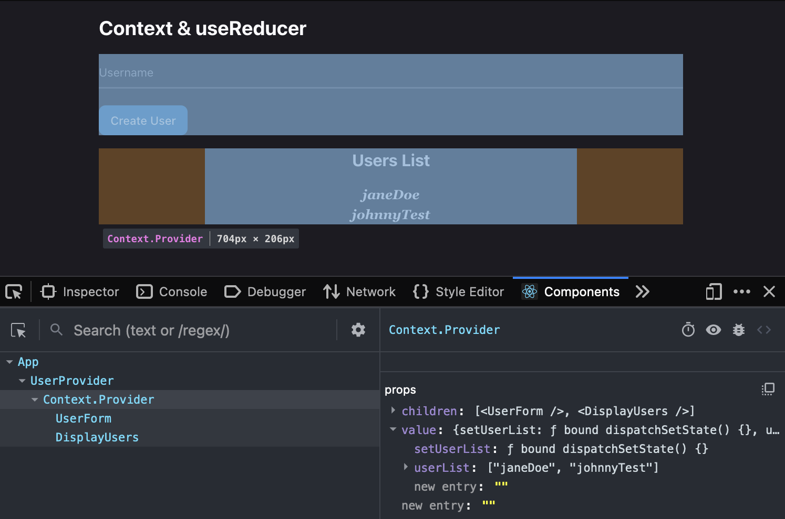
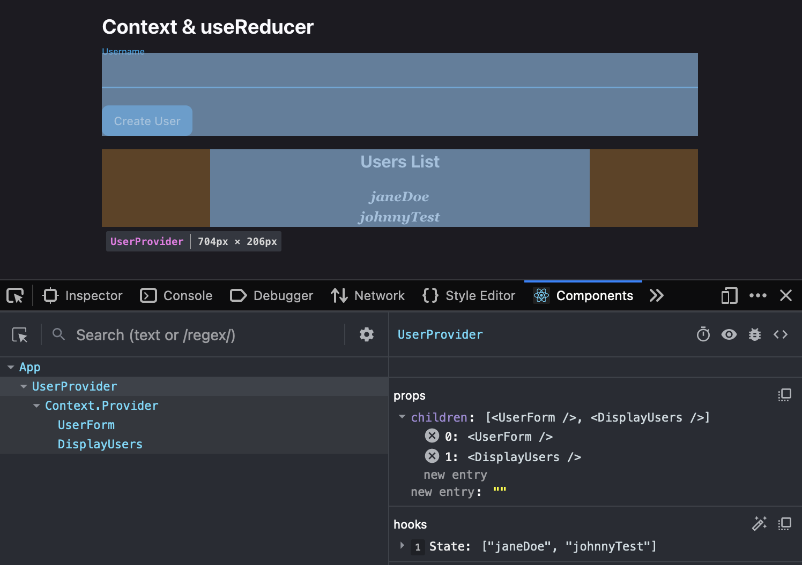
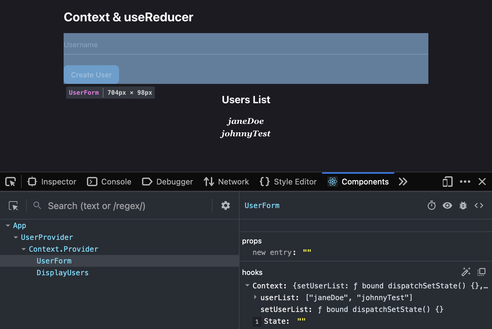
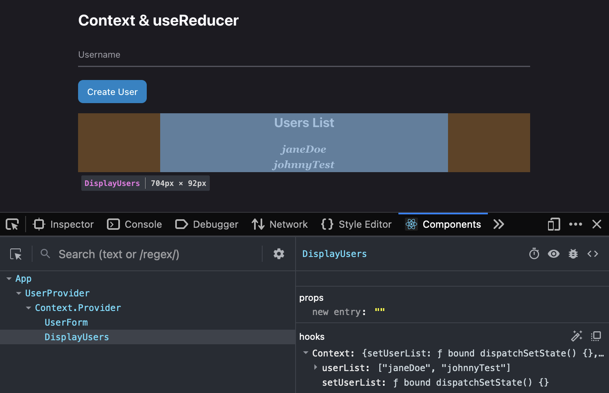
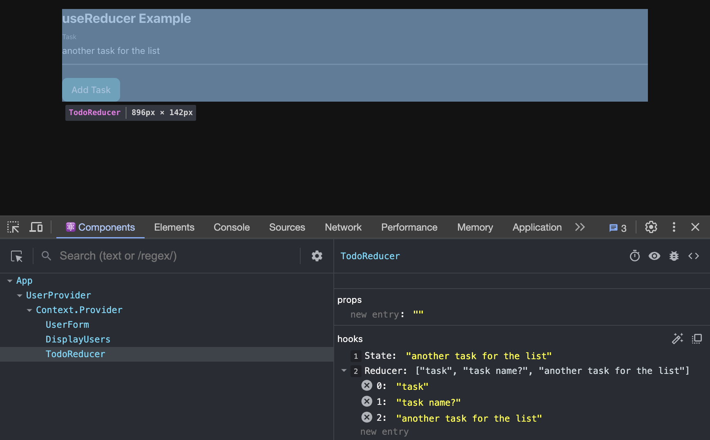

# D21: `useContext` & `useReducer`

<div style="display: flex; justify-content: space-between;">
    <p>Week 8 Session 1</p>
    <p>２０２４年０２月０３日（土）</p>
</div>

## Table of Contents
- [**`useContext`**](#usecontext)
    - [File Structure](#file-structure)
    - [`UserContext.jsx`](#usercontextjsx)
    - [Usage of `.Consumer` with Class Components](#usage-of-consumer-with-class-components)
    - [Main Component: `App.jsx`](#main-component-appjsx)
    - [Application in Components: `UserForm.jsx` and `DisplayUsers.jsx`](#application-in-components-userformjsx-and-displayusersjsx)

- [**`useReducer`**](#usereducer)
    - [Reducer Function (`reducer`)](#reducer-function-reducer)
    - [Component State and `useReducer`](#component-state-and-usereducer)
    - [Submitting a Todo](#submitting-a-todo)
    - [Form Rendering](#form-rendering)

## useContext
`useContext` is a React Hook that simplifies the process of sharing and accessing global state across components. It allows a component to subscribe to a specific context, gaining direct access to the values provided by a `Context.Provider` higher up in the component tree. By utilizing `useContext`, components can consume shared data without the need for prop drilling, streamlining the flow of information and enhancing the overall maintainability and scalability of React applications. This hook is particularly useful for scenarios where multiple components need access to common state or configuration, offering a concise and efficient solution for managing shared data in a React application.

### File Structure
```plaintext
src/
|___components/
|___context/
|       |___UserContext.jsx
|
|___App.jsx
```

### `UserContext.jsx`
```jsx
// Import necessary modules
import React, { createContext, useState } from 'react';

// 1. Create a context using createContext
export const userContext = createContext();

// 2. Create a UserProvider component to manage the state
export const UserProvider = (props) => {
    // Set up state for userList
    const [userList, setUserList] = useState([]);

    // 3. Provide the state to the components using the context
    return (
        <userContext.Provider value={{
            userList,
            setUserList
        }}>
            {props.children}
        </userContext.Provider>
    );
}
```

#### Explanation:
1. **Context Creation:** `createContext` is used to create a context named `userContext`. This context will hold the state that needs to be shared among different components.

2. **State Management:** The `UserProvider` component is created. This component manages the state related to user data (in this case, `userList`) and provides it to the components that are wrapped inside it.

3. **Providing Context Value:** The `userList` state and the `setUserList` function are provided as a value to the context using the `value` prop of `userContext.Provider`. This makes these values accessible to any component that consumes this context.


## Usage of `.Consumer` with Class Components
In scenarios where your React application is built using class components, you can consume context values using the `.Consumer` component. This is an alternative to the `useContext` hook, which is commonly used in functional components. The following example demonstrates how to utilize `.Consumer` within a class component, specifically accessing and updating the user list from the `UserContext`.

```jsx
import React from 'react';
import { UserContext } from './path-to-your-context/UserContext';

class ExampleComponent extends React.Component {
  render() {
    return (
      // Using Context.Consumer to access context values
      <UserContext.Consumer>
        {({ userList, setUserList }) => (
          <div>
            <p>User List: {userList.join(', ')}</p>
            <button onClick={() => setUserList([...userList, 'New User'])}>
              Add User
            </button>
          </div>
        )}
      </UserContext.Consumer>
    );
  }
}

export default ExampleComponent;
```

In this example, the `.Consumer` component allows class components to efficiently consume and interact with context values provided by a `Context.Provider`. While modern React applications often use functional components and hooks like `useContext`, understanding the `.Consumer` approach is valuable, especially when working with legacy codebases or class-based React components.

<div align="center">

</div>

### Main Component: `App.jsx`
```jsx
import DisplayUsers from "./components/DisplayUsers"
import UserForm from "./components/UserForm"
import { UserProvider } from './context/UserContext'

function App() {
    return (
        <>
            <div className="container mx-auto">
                <h1 className='my-4 font-bold text-2xl'>Context & useReducer</h1>
                {/* 4. Wrap components with the UserProvider */}
                <UserProvider>
                    <UserForm />
                    <DisplayUsers />
                </UserProvider>
            </div>
        </>
    )
}

export default App
```

#### Explanation:
**Provider Wrapping:** The `UserForm` and `DisplayUsers` components are wrapped with the `UserProvider`. This ensures that these components, and any descendants of them, have access to the state provided by the `UserProvider`.
<div align="center">

</div>


### Application in Components: `UserForm.jsx` and `DisplayUsers.jsx`
Both of these components use the `useContext` hook to access the `userContext`. They can directly read from and write to the `userList` state, making it easy to share and update the user data across components.

This setup enables the components to interact with the shared state managed by `useContext`, facilitating a centralized approach to state management in your React application.


#### `UserForm.jsx`

```jsx
import React, { useContext, useState } from 'react';
import { userContext } from '../context/UserContext';

const UserForm = () => {
    
    const { userList, setUserList } = useContext(userContext);
    const [ username, setUsername ] = useState("");
    
    const submitHandler = e => {
        e.preventDefault();
        setUserList([ ...userList, username ]);
        setUsername("");
    }
    
    return (
        <div className='mx-w-md mx-auto'>
            {/* Form setup */}
        </div>
    );
}

export default UserForm;
```
<div align="center">

</div>


#### `DisplayUsers.jsx`

```jsx
import React, { useState, useContext } from 'react';
import { userContext } from '../context/UserContext';

const DisplayUsers = (props) => {
    const {userList, setUserList} = useContext(userContext);
    
    return (
        <div className='max-w-md mx-auto text-center'>
            <h2 className='my-4 font-bold text-xl'>Users List</h2>
            { userList.map((user, id) => (
                    <p key={id} className='font-serif font-semibold italic'>
                        {user}
                    </p>
            ))}
        </div>
)}

export default DisplayUsers;
```
<div align="center">

</div>


## useReducer
`useReducer` is a React Hook that is used for managing more complex state logic in React applications. It is particularly useful when the state transitions depend on the previous state and involve complex logic, such as in the case of handling different actions.

In the `TodoReducer.jsx` code, a simple example of `useReducer` is demonstrated. Let's break down the key elements:

### Reducer Function (`reducer`)
```jsx
const reducer = (todos, action) => {
    console.log(`TODOS: ${todos}`);
    console.log('PAYLOAD', action.payload);
    console.log('PAYLOAD TODO', action.payload.todo);
    switch(action.type){
        case 'ADD_TODO':
            return [...todos, action.payload.todo];
    }
}
```
- The `reducer` function takes two parameters: `todos` (current state) and `action` (an object describing what happened).
- The function logs the current state (`todos`), the payload of the action, and the specific `todo` from the payload for debugging purposes.
- Inside the switch statement, the function handles different action types. In this example, it specifically handles the 'ADD_TODO' action type, where it returns a new state by spreading the existing `todos` and adding the new todo item from the action payload.

<div align="center">

</div>

### Component State and `useReducer`
```jsx
const [ todo, setTodo ] = useState('');
const [ todoList, dispatch ] = useReducer(reducer, []);
```
- The component uses the `useState` hook to manage the local state of `todo`, representing the value of the input field.
- `useReducer` is used to manage a more complex state, `todoList`, by invoking the `reducer` function. The initial state is an empty array (`[]`).

### Submitting a Todo
```jsx
const submitTodo = (e) => {
    e.preventDefault();
    dispatch({ type:'ADD_TODO', payload:{todo:todo} });
}
```
- The `submitTodo` function is triggered when the form is submitted.
- It prevents the default form submission behavior.
- It calls the `dispatch` function with an action object, specifying the type as 'ADD_TODO' and providing a payload containing the new todo item (`{todo: todo}`).

### Form Rendering
```jsx
<input type="text" value={ todo } onChange={(e) => setTodo(e.target.value)} />
<button type="submit">Add Task</button>
```
- The input field is controlled by the `todo` state, ensuring that the input value reflects the state.
- The `onChange` handler updates the `todo` state as the user types.
- The form has a submit button triggering the `submitTodo` function.

Overall, this example demonstrates how `useReducer` can be used to manage state transitions and actions in a React component. It is particularly beneficial when dealing with more complex state logic or when actions involve intricate computations based on the previous state.